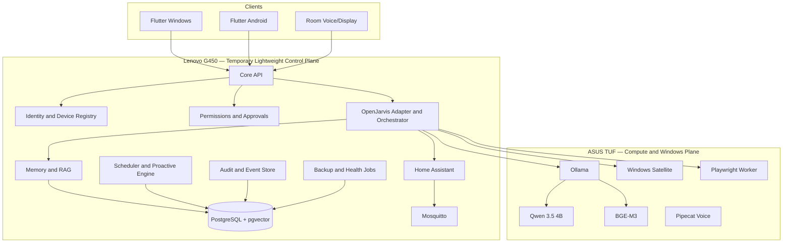

# BMO Personal AI OS — Master Architecture and Execution Plan

> **Canonical source of truth**
>
> **Status:** Locked baseline  
> **Plan version:** 1.7
> **Baseline date:** 2026-08-22
> **Owner:** Mahmoud  
> **Repository:** `MahmoudNagiubX/BMO-Personal-AI-OS`  
> **Required software subscription cost:** **0 EGP/month**  
> **Change policy:** Any architecture-changing decision must update this file and add or supersede an ADR.

The lossless original 3,404-line plan remains retained in `docs/archive/MASTER_PLAN_FULL.md.gz.b64`. Run `python scripts/restore_full_master_plan.py` to restore it for historical detail. This readable file is the active implementation contract.

---

# 0. How to Use This Plan

Before every implementation session, read:

1. `AGENTS.md`.
2. `docs/IMPLEMENTATION_STATUS.md`.
3. The active phase specification.
4. The relevant sections of this plan.
5. Every accepted or superseding ADR that affects the task.

Repository documents override remembered chat details. Record owner-reported hardware separately from physically verified evidence. Never silently alter a locked decision.

---

# 1. Product Vision

BMO Personal AI OS is a **local-first, multimodal, agentic personal operating system** for Mahmoud’s life, room, projects, and devices. It is not a voice-command demo and not a generic chatbot with a Jarvis prompt.

The final system should:

- Speak naturally in Arabic, English, and mixed Arabic-English.
- Maintain one approved owner identity, memory system, and permission model.
- Continue conversations across Windows, Android, browser, and room clients.
- Search approved files, notes, PDFs, repositories, tasks, and saved research.
- Search the public web, verify evidence, and save findings into the correct area.
- Open approved applications, projects, files, and websites.
- Start predefined development and productivity workflows.
- Monitor selected device and room conditions.
- Control room devices through Home Assistant.
- Manage tasks, reminders, routines, focus sessions, and project milestones.
- Perform bounded multi-step tasks with visible progress.
- Ask for approval before consequential actions.
- Learn through inspectable, correctable, exportable, and deletable memory.
- Provide useful proactive notifications without becoming intrusive.
- Work without a required paid API or monthly software subscription.

## Product promise

> **One identity, one memory system, one permission model, many clients, and many scoped device agents.**

## Non-goals

The early system will not:

- Claim fictional human-level AGI.
- Give an LLM unrestricted shell, banking, password, or account access.
- Record all audio, screens, location, or browsing continuously.
- Replace medical, legal, or financial professionals.
- Run heavy AI inference on the desktop server’s GT 710.
- Automate every app through fragile screen clicking.
- Rebuild smart-home infrastructure already solved by Home Assistant.
- Fine-tune a large model before an evaluation dataset exists.
- Become a public multi-tenant SaaS.
- Require cloud models or paid services.

---

# 2. Locked Decisions

| Area | Locked decision |
|---|---|
| Product name | BMO Personal AI OS |
| Repository | `MahmoudNagiubX/BMO-Personal-AI-OS` |
| Repository style | Monorepo |
| Initial topology | Modular monolith plus independent device agents |
| Backend | Python 3.12 + FastAPI |
| Package management | `uv` with committed `uv.lock` |
| Main AI framework | OpenJarvis behind the product-owned adapter |
| OpenJarvis baseline | `v1.0.0`, commit `e97088f199cf86ea5f78de921772357d1f0d2cec` |
| OpenJarvis strategy | Pinned dependency; no direct imports outside adapter; no immediate fork |
| Architecture reference | Leon 2.0 patterns only; not the product base |
| Database | PostgreSQL |
| Vector search | pgvector |
| Sparse search | PostgreSQL full-text search initially |
| Retrieval | Hybrid dense + sparse; reranker only after measured need |
| Embeddings | BGE-M3 through Ollama |
| Primary generation/orchestration/vision model | Qwen 3.5 4B through Ollama |
| Larger local reasoning model | Optional advanced local-only llama.cpp provider; never required for MVP or Phase 4 acceptance |
| Heavy compute host | ASUS TUF F15, RTX 4050, 16 GB RAM, Windows |
| Always-on host | Lenovo G450 — temporary lightweight control plane defined by ADR-0007 |
| Server OS | Ubuntu Server 24.04.4 LTS AMD64, headless, no GUI |
| Server deployment | Docker Compose plus selected native host services when justified |
| Server local heavy LLM | Disabled |
| Cloud LLM | Optional, disabled, never required |
| Room control | Home Assistant Container |
| Device messaging | Mosquitto MQTT |
| Standard ESP firmware | ESPHome where possible |
| Voice framework | Pipecat |
| Wake word | Exact local `Hey Jarvis` wake phrase for Phase 10, using the pinned zero-cost official openWakeWord migration candidate; room deployment remains Phase 11 |
| VAD | Silero VAD |
| STT | faster-whisper multilingual; initial `medium`, benchmarked |
| Arabic TTS | sherpa-onnx with `vits-piper-ar_JO-kareem-medium` baseline |
| English TTS | Local medium Piper/VITS voice selected by benchmark |
| Product clients | Flutter for Windows and Android |
| Real-time client channel | WebSocket |
| Device/event channels | MQTT plus HTTPS/WebSocket |
| Authentication | Per-device identity and revocable scoped credentials |
| Remote access | LAN first; WireGuard preferred; Tailscale optional |
| Background jobs | Database-backed scheduler; no Redis in MVP |
| Browser automation | Playwright in isolated profile |
| Windows automation | Typed allowlisted Windows satellite tools |
| Dangerous actions | Explicit human approval |
| General shell | Never exposed to the main agent |
| External analytics | Disabled |
| Required software cost | 0 EGP/month |
| Testing | Targeted tests during work; full suite at phase gates |
| License | Apache 2.0 for original code |

---

# 3. Hardware and Device Roles

## 3.1 Lenovo G450 — temporary lightweight always-on control plane

ADR-0007 is the active host decision. The owner-provided `VENOM_SERVER_FOUNDATION_COMPLETE_HANDOFF` verifies the earlier Core 2 Duo class CPU planning fact as an Intel Core 2 Duo T6500 with 2 cores, approximately 4 GB RAM, `/dev/sda` as a Seagate ST9320325AS at approximately 298 GB, x86_64 architecture, hostname `venom-server`, Linux user `venom`, Ubuntu Server 24.04.4 LTS, clean SMART health, and a passed SMART short test. Ethernet, firmware boot mode, memory pressure, thermals, fans, battery, power, hardening, backup/restore, reboot, and stability still require physical gate evidence.

### Operating baseline

- Ubuntu Server 24.04.4 LTS AMD64, headless, with no desktop GUI.
- Preserve Legacy BIOS/MBR compatibility in installation planning; verify actual boot mode physically.
- DHCP is acceptable during initial installation; a fixed address or DHCP reservation follows network inspection.
- SSH is required after installation; services are private-LAN only with no public port forwarding.
- Wired Ethernet is the expected network path.

### Responsibilities and limits

- Core API and lightweight orchestration, identity/device registry, permissions, approvals, scheduler, and audit/event coordination.
- Mosquitto MQTT, model gateway, ASUS TUF health routing, lightweight notifications/service discovery, and backup coordination.
- Home Assistant and PostgreSQL/pgvector only after measured storage, RAM, and load acceptance.
- No Qwen3.5 4B or BGE-M3 inference, local heavy LLM, heavy STT/TTS, heavy vision/indexing, or unrestricted LLM shell.

### Resource and preservation policy

- Keep the installation minimal and headless; configure swap only after disk and RAM inspection, with no preselected final size.
- Admit Docker and services gradually from measured memory, disk, and load pressure.
- Require SMART monitoring, bounded logs, free-space thresholds, off-device backups, restore evidence, and 24-hour then seven-day stability gates. ADR-0008 records a dated, owner-approved exception only for the current Lenovo temporary control plane after immediate closeout: unelapsed windows are waived as blocking prerequisites for Phase 5B progression, never reported as a stability PASS. A replacement or migration host requires its own gates unless separately waived.
- Do not add Redis, Kafka, Elasticsearch, Kubernetes, Prometheus, Grafana, or a local heavy LLM without an accepted ADR and measured need.

### Desktop PC status

The desktop PC and its ADR-0005 hardware record are preserved as historical evidence. It is a future control-plane upgrade or migration candidate, not an active required node, deployment authority, mandatory safety gate, or Phase 5B prerequisite. A Lenovo-to-desktop migration requires a new owner-approved ADR and a separate safety gate.

## 3.2 ASUS TUF — heavy compute and Windows execution plane

Responsibilities:

- Ollama model server.
- Qwen 3.5 4B as the initial primary generation, orchestration, and vision model. The optional Qwen3.5-9B Heretic v2 llama.cpp provider is a separate Phase 8.5 admission and never displaces the fast default.
- BGE-M3 embeddings when accepted by benchmark.
- Heavy STT, TTS, vision, and indexing.
- Windows device satellite.
- Isolated Playwright browser worker.
- Development, testing, benchmarking, and repository tools.

The TUF is not the always-on authority. When it is off, accepted Lenovo-hosted deterministic functions continue and full AI conversation may be reduced or unavailable until the TUF returns or is woken.

## 3.3 Samsung A54 — personal companion

The Flutter Android app provides:

- Text and voice conversation.
- Approval requests.
- Notifications and daily briefs.
- Quick note, image, and voice capture.
- Task and routine controls.
- Room and PC remote controls.
- Camera input only on explicit request.
- Location only through explicit permission and retention policy.

Do not use unrestricted accessibility automation.

## 3.4 ESP32 and room nodes

Use ESPHome where possible. Room nodes may provide sensors, LEDs, relays, IR, microphones, speakers, and displays. Safety-critical loads require suitable hardware, electrical isolation, manual control, and explicit safety limits.

## 3.5 Historical branch boundary

ADR-0003 remains historical and ADR-0005 is superseded by ADR-0007. `phase-01/lenovo-foundation` remains audit history and must not be merged, rebased, force-pushed, rewritten, or reused. The repository-side Phase 1 foundation uses the new `phase-01/lenovo-control-plane-foundation` branch from current `main`; physical work remains a separate owner-authorized safety-gate activity.

---

# 4. Repository and Open-Source Strategy

## Our repository owns

- Product identity and owner profile.
- Data contracts and database schema.
- Permission and approval engine.
- Device identity and protocols.
- Memory policy and review UX.
- OpenJarvis adapter.
- Model routing.
- Windows and mobile satellites.
- Home Assistant bridge.
- Voice orchestration.
- Product UI and animations.
- Audit, observability, backups, and runbooks.

## External components

- **OpenJarvis:** agent/runtime foundation behind `packages/openjarvis_adapter/`.
- **Leon:** design reference for smart/controlled/agent modes, profiles, satellites, layered memory, and bounded proactive behavior.
- **Home Assistant:** authoritative room automation system.
- **Pipecat:** real-time voice pipeline.
- **Ollama:** local model service.
- **faster-whisper, pinned openWakeWord Hey Jarvis candidate, Silero VAD, sherpa-onnx:** current local voice stack; microWakeWord remains historical evidence.
- **Playwright:** isolated browser execution.

No non-commercial core dependency may be introduced without an ADR. Every model, voice, dataset, and copied implementation must be recorded in `docs/legal/LICENSE_INVENTORY.md`.

---

# 5. Technology Stack

## Backend and data

- Python 3.12.
- FastAPI and Pydantic.
- SQLAlchemy 2 and Alembic.
- PostgreSQL and pgvector.
- PostgreSQL full-text search.
- Local filesystem object storage initially.
- Database-backed scheduler.
- restic encrypted backups.

## AI

- OpenJarvis adapter.
- Ollama inference.
- Qwen 3.5 4B primary generation, conversation, orchestration, and vision model.
- Optional Qwen3.5-9B Heretic v2 through the pinned local llama.cpp provider defined by ADR-0009; Codex remains the coding specialist.
- BGE-M3 embeddings.
- No required cloud provider.

## Voice

- Phase 10 uses one current incumbent path for the exact `Hey Jarvis` phrase: the pinned official openWakeWord `hey_jarvis_v0.1.onnx` candidate followed by a bounded local faster-whisper exact-prefix verifier, rolling Silero VAD/local Smart Turn, authenticated Core API/agent, and safe phrase/sentence sherpa-onnx TTS. ADR-0018 records the migration, ADR-0019 is historical cleanup evidence, and ADR-0020 records the fresh backend reselection. The comparison commit `a9ec14cf014c1413ed17f2aa641723ec75a5dd80` measured microWakeWord v2 at 217/504 recall and 262/7,268 false activations, and the openWakeWord cascade at 489/504 recall and 75/7,268 false activations, plus one false wake in a five-hour stream. Neither meets the locked 98% / 0.25% / 0.1 FAPH software gate, so no owner physical session is authorized. Bare `Jarvis`, MFCC, WakeForge, microWakeWord, Sherpa KWS, Vosk, PocketSphinx, and other candidate results remain historical evidence only.
- Exact `Hey Jarvis`, double-tap Right Ctrl, and PTT share one activation router and pipeline. Bounded in-memory pre-roll, follow-up turns, cancellable TTS, and real barge-in are product-owned behavior; Pipecat remains behind adapters.
- Push-to-talk is a fallback/debug/privacy control and is not the normal production interaction.
- Phase 11 separately contains room and multi-device voice; it is not started by Phase 10.

## Clients and device integration

- Flutter Windows and Android.
- WebSocket for live dialogue and UI state.
- MQTT for room/device events.
- HTTPS/WebSocket for authenticated high-level actions.
- ESPHome and Home Assistant.
- Native Windows satellite using typed Python/PowerShell wrappers.

## Deployment

- Docker Compose and selected services on the Lenovo only after measured safety and resource acceptance.
- Native Ollama on the ASUS TUF.
- Native Windows agent on the ASUS TUF.
- GitHub Actions CI.
- Secrets remain untracked and move to proper secret storage before production.

---

# 6. Architecture Principles

1. **Local first, not local only.** Paid/cloud providers are optional, visible, metered, and disabled by default.
2. **Central authority, distributed execution.** The Lenovo control plane owns accepted identity, permissions, scheduling, and audit responsibilities; the owning device executes each capability.
3. **Typed tools, never arbitrary shell.** Tools use strict schemas, allowlists, risk levels, scopes, and verified observations.
4. **Modular monolith first.** Split services only after measured operational need.
5. **Deterministic before agentic.** Known actions use reliable code; the LLM interprets intent and selects tools.
6. **No invisible learning.** Durable memories have source, confidence, sensitivity, scope, approval, retention, and edit/delete controls.
7. **Every action is attributable.** Store requester, client, run ID, tool, redacted arguments, authorization, approval, result, error, and reversal data.
8. **Fail closed.** Missing identity, scope, availability, approval, or validation means no action.
9. **Degraded states are honest.** Report when TUF, voice, browser, home, database, or a satellite is unavailable.
10. **Animations represent real states.** UI never fakes thinking or execution.
11. **Hardware is replaceable behind stable contracts.** Product-domain code does not depend on a specific chassis or hostname.
12. **Preserve hardware through bounded load.** Stock clocks, thermal targets, log rotation, storage monitoring, backups, and staged stability gates are mandatory.

---

# 7. Target Architecture



## Core modules

```text
identity, devices, conversations, agent_runtime, model_gateway,
tools, permissions, approvals, memory, knowledge, tasks, routines,
scheduler, proactive, notifications, integrations, telemetry, audit, admin
```

Each module owns its domain models, service interface, repository interface, routes, events, and tests. Framework imports remain at boundaries.

## Capability ownership

- `core`: tasks, memory, profile, knowledge, scheduling.
- `windows`: applications, files, system telemetry, media, approved development workflows.
- `browser`: isolated web interaction.
- `home`: approved Home Assistant entities, scenes, and scripts.
- `mobile`: approved Android-local actions.
- `voice`: audio input/output state.
- `github`: scoped repository actions.

Disconnected devices automatically lose tool availability. The agent must never claim execution without a verified result.

---

# 8. Request and Action Lifecycle

1. Client sends a request with device credential and correlation ID.
2. Core authenticates device, owner, session, and scopes.
3. Relevant structured state, memory, and knowledge are retrieved.
4. Deterministic router chooses a direct workflow or bounded agent runtime.
5. Qwen 3.5 4B is the initial primary language, orchestration, and vision model; Codex owns coding-specialist workflows. The optional advanced model is selected only explicitly through the deterministic gateway and never silently replaces the fast model.
6. Every proposed tool call is validated against schema, scope, risk, device availability, rate limits, and policy.
7. Consequential or critical actions create an approval preview.
8. The owning satellite executes the typed action.
9. The tool returns a structured observation with verification evidence.
10. The agent continues only within iteration, time, token, and action budgets.
11. The final response distinguishes verified facts, assumptions, and failures.
12. Audit and trace records are persisted with redaction.
13. Memory extraction occurs separately and may require review.

When the TUF is offline, deterministic server services continue. Full AI conversation may be unavailable or reduced; the core may optionally wake the TUF through Wake-on-LAN.

---

# 9. Model Architecture

## Initial primary model — Qwen 3.5 4B

Use for conversation, intent understanding, Arabic/English mixed interaction, vision/screenshots, structured output, tool-call data, workflow selection, short/medium planning, and result summarization. Initial context: **8K**, benchmark up to **16K**.

## Optional advanced local reasoning model

Qwen3.5-9B Heretic v2 Q4_K_M is admitted only as the measured, owner-approved, local-only llama.cpp provider defined by ADR-0009. It is text-only, uses the exact pinned b10502 runtime and N_SAFE=20 profile, is not automatically downloaded, is not required for MVP or Phase 4 acceptance, and has no cloud or fast-model fallback. Codex is the coding specialist; deterministic product code owns permissions, approvals, validation, state machines, retries, execution, and verification.

## Embeddings — BGE-M3

Use for multilingual personal memory, project knowledge, and document retrieval. Store model name, revision/digest, embedding dimension, chunking policy, and creation timestamp with each index version.

## Routing rules

- Deterministic workflow before LLM.
- Qwen 3.5 4B is the default active generation model. Explicit `advanced` routing may select only the ADR-0009 llama.cpp identity and only for supported text generation/chat; future provider or artifact changes require a new measured architecture decision.
- The fast and advanced providers are loopback-only and share a one-heavy-model residency guard. An unavailable advanced provider fails closed and never falls back silently.
- No silent cloud fallback.
- Model output never equals execution proof.
- Tool observations and source evidence dominate hallucinated claims.
- The desktop server does not run the heavy model baseline.

## TUF benchmark gate

Confirm GPU VRAM with `nvidia-smi`, then benchmark load time, first-token latency, tokens/sec, RAM/VRAM, context size, Arabic, English, mixed language, tool calling, structured output, vision, and thermal behavior. Pin exact Ollama digests after acceptance.

---

# 10. Voice Architecture

```text
SLEEPING → WAKE_DETECTED → LISTENING → SPEECH_DETECTED → TRANSCRIBING
→ SENDING → WAITING_FOR_RESPONSE → SPEAKING → FOLLOW_UP_LISTENING
→ SLEEPING

Barge-in transitions speaking to INTERRUPTED and then LISTENING. Degraded and
failed states are explicit. Manual capture is a fallback only.
```

Errors and degraded states are explicit.

Implementation order:

1. Local wake-word-only idle and bounded microphone capture.
2. Streaming microphone transport with VAD and end-of-turn detection.
3. Multilingual STT benchmark.
4. Core text/agent integration through existing identity and conversation authority.
5. Local Arabic and English TTS benchmark.
6. Barge-in, interruption, and bounded follow-up listening.
7. Push-to-talk fallback using the same downstream pipeline.
8. Phase 11 room-node and multi-device work is deferred and not part of this phase.

Audio is not stored by default. Any retention feature requires explicit purpose, consent, encryption, retention, and deletion policy.

---

# 11. Memory and Knowledge System

Memory classes:

1. Owner profile.
2. Episodic memory.
3. Structured life data.
4. Knowledge/RAG.
5. Short-lived telemetry summaries.

Every durable memory includes source, source reference, confidence, sensitivity, scope, approval state, validity, timestamps, and retention metadata.

Write policy:

- Explicit owner statements may be saved with high confidence.
- Inferred memories enter pending review unless a low-risk policy allows them.
- Sensitive memories require clear purpose and controls.
- Contradictions preserve provenance and trigger review.
- Raw conversations are not automatically permanent facts.

Retrieval:

- Filter by owner, scope, sensitivity, validity, and permission.
- Combine PostgreSQL full-text and pgvector results.
- Deduplicate and rerank only when measured value exists.
- Return source attribution.
- Keep retrieved untrusted instructions separate from system/tool authority.

The owner can inspect, edit, reject, delete, export, and trace memories to their sources.

---

# 12. Identity, Devices, Permissions, and Approval

Device enrollment:

- Generate a short-lived enrollment code locally.
- Device creates or receives its own credential.
- Owner approves name, type, scopes, and capabilities.
- Server stores credential hash and metadata, not plaintext reusable secrets where avoidable.
- Each device is independently revocable.

Risk levels:

| Level | Examples | Behavior |
|---|---|---|
| Read | status, search, calendar view | execute after scope check |
| Reversible | open app, change volume, light scene | execute and audit |
| Consequential | modify files, send message, publish GitHub change | exact preview and approval |
| Critical | delete data, security settings, purchases | strong dedicated flow |
| Forbidden autonomous | banking, passwords, dangerous hardware, unrestricted shell | never expose to normal agent |

Changed arguments invalidate an approval.

---

# 13. Tool Platform and Satellites

A tool definition includes:

```text
name, version, owner device, description, JSON schema, required scopes,
risk level, approval rule, availability check, timeout, idempotency,
rate limit, audit redaction, verification method, reversal metadata
```

## Windows satellite MVP

- System status: CPU, RAM, GPU, disk, battery, network.
- Open allowlisted application or project.
- Search approved directories.
- Set volume and media state.
- Start approved scripts/workflows by ID.
- Return screenshots only on explicit request and policy approval.

Never accept arbitrary executable paths or arbitrary PowerShell from the model.

## Browser worker

- Isolated Playwright profile.
- Domain allow/deny policy.
- Download quarantine.
- No access to normal browser cookies/passwords.
- Web content is untrusted.
- Forms, sends, uploads, purchases, and account changes require approval.

## Home Assistant bridge

Home Assistant owns room state and automation. BMO exposes only selected entities, scenes, and scripts. Prefer high-level scenes over direct low-level relay manipulation. Keep physical manual control and safety limits.

---

# 14. Core Data Domains

Initial PostgreSQL domains:

- owners and profiles;
- devices, credentials, scopes, and capabilities;
- sessions and conversations;
- agent runs, steps, tool calls, observations, and traces;
- permission decisions and approvals;
- memories, sources, embeddings, and knowledge documents/chunks;
- tasks, routines, schedules, events, and notifications;
- integrations and connection metadata;
- audit events;
- telemetry summaries and retention metadata.

Use UUIDs for cross-device IDs and UTC ISO-8601 timestamps. Sensitive columns require explicit classification. Migrations require rollback/restore strategy and backup gates.

---

# 15. API and Event Contracts

Initial API families:

```text
/health, /ready, /version
/v1/auth, /v1/devices, /v1/conversations, /v1/agent-runs
/v1/tools, /v1/approvals, /v1/memory, /v1/knowledge
/v1/tasks, /v1/routines, /v1/notifications, /v1/integrations
/v1/audit, /v1/admin
```

WebSocket events represent real backend states, streamed text/audio references, tool proposals, approval requests, execution progress, errors, and degraded-service notifications.

MQTT topics are namespaced, authenticated, ACL-controlled, and versioned. High-level commands must not be unauthenticated raw text.

---

# 16. Security and Privacy Baseline

Primary threats:

- Prompt injection from web, email, and files.
- Compromised device or stolen token.
- Overpowered tool.
- Accidental destructive action.
- Public Ollama, MQTT, database, Home Assistant, or API exposure.
- Sensitive memory leakage.
- Malicious dependency or model update.
- Backup theft.
- Unsafe room hardware.
- Hallucinated execution claims.

Required mitigations:

- Per-device identity and scopes.
- Credential rotation and revocation.
- Private networking and authenticated channels.
- MQTT ACLs.
- Typed tools and allowlists.
- Static risk classification.
- Exact human approvals.
- Sandboxing and isolation.
- Output/result verification.
- Structured redacted audit logs.
- Dependency/model pinning and license inventory.
- Secret scanning.
- Encrypted backups.
- Retention/deletion policies.
- Manual physical overrides.
- No public model endpoint.
- No raw audio/screenshot retention by default.

Create a detailed threat model before Phase 8 closes.

---

# 17. Observability, Backups, and Recovery

Start lightweight:

- JSON structured logs.
- Correlation IDs.
- Health and readiness endpoints.
- Agent/tool trace viewer.
- Model latency and failure metrics.
- Device heartbeat and last-seen status.
- Scheduler and backup success records.
- Server CPU, memory, disk, SMART, temperature, fan, and service-health checks.

Do not overload the desktop server with a large monitoring stack during MVP.

Backups use restic encryption and a 3-2-1 direction where practical:

- Nightly database backup.
- Configuration and memory/document metadata backup.
- Separate backup of approved file store.
- Off-device copy required before production acceptance.
- Exclude caches, model weights, raw temporary audio, and reproducible artifacts.
- Test restoration regularly.

A backup is not accepted until restore is proven. Document failed-server, failed-TUF, corrupt-database, lost-device, power-loss, and compromised-token recovery.

---

# 18. Testing Strategy

Layers:

- Unit tests for domain logic and policy.
- Contract tests for OpenJarvis adapter, device protocols, tools, model structured outputs, and integrations.
- Integration tests with PostgreSQL, MQTT, Home Assistant test environment, and simulated satellites.
- Security tests for authorization, approval replay/expiry, path traversal, allowlists, prompt injection, SSRF, data leakage, and public binding.
- End-to-end tests for text request, approval, Windows action, room scene, memory review, TUF offline, and recovery.
- Model/voice evaluation datasets for Arabic, English, mixed language, routing, tool calling, retrieval, latency, and hallucinated completion.
- Physical-server tests for inventory, SMART, memory, thermals, Ethernet, AC recovery, Docker restart, backup/restore, and stability.

Run targeted tests frequently. Run the complete suite at each phase checkpoint. Never report a test as passing unless it actually ran in the current workspace or authoritative CI.

---

# 19. Repository Structure

```text
BMO-Personal-AI-OS/
├── AGENTS.md
├── README.md
├── START_HERE.md
├── apps/
│   ├── core_api/
│   ├── flutter_client/
│   └── admin_dashboard/
├── packages/
│   ├── openjarvis_adapter/
│   ├── domain/
│   ├── tool_contracts/
│   ├── event_contracts/
│   └── shared_models/
├── satellites/
│   ├── windows_agent/
│   ├── android_bridge/
│   └── room_agent/
├── integrations/
│   ├── home_assistant/
│   ├── browser/
│   ├── github/
│   ├── calendar/
│   ├── email/
│   └── smart_life_planner/
├── infrastructure/
│   ├── compose/
│   ├── home_server/
│   ├── tuf/
│   ├── networking/
│   └── backups/
├── docs/
│   ├── MASTER_PLAN.md
│   ├── IMPLEMENTATION_STATUS.md
│   ├── phases/
│   ├── adr/
│   ├── architecture/
│   ├── api/
│   ├── security/
│   ├── privacy/
│   ├── legal/
│   ├── runbooks/
│   └── phase_reports/
├── scripts/
└── tests/
```

Create directories only when their phase begins.

---

# 20. Execution Roadmap

## Phase 0 — Governance and source of truth

Repository rules, master plan, status ledger, ADRs, legal inventory, secret exclusions, Python tooling, CI, tests, and bounded agent prompts. No product code.

## Phase 1 — Lenovo G450 safety, Ubuntu Server, and network foundation

Verify exact hardware; test disk/SMART, memory, thermals, fans, battery, Ethernet, and power behavior; install Ubuntu Server 24.04.4 LTS AMD64 headlessly with Legacy BIOS/MBR compatibility retained in planning; harden SSH/private-LAN services; admit Docker and services only from measured resource evidence; configure log rotation, backups, and TUF Wake-on-LAN when later authorized; pass 24-hour then seven-day stability gates. ADR-0008 is a dated owner waiver for Phase 5B progression only after immediate closeout, not a stability PASS and not a replacement-host exemption.

The historical `phase-01/lenovo-foundation` branch must not be merged or reused. Future work starts from then-current `main` on a new `phase-01/lenovo-control-plane-foundation` branch.

## Phase 2 — Core platform skeleton

Modular-monolith boundaries, FastAPI health/version endpoints, PostgreSQL/pgvector Compose setup, Alembic, configuration, structured logging, correlation IDs, and CI integration tests. No agent behavior.

## Phase 3 — OpenJarvis compatibility spike

Pinned OpenJarvis release, adapter boundary, analytics disabled, trace/tool/model translation, and local request-flow contract proof. No direct imports elsewhere.

## Phase 4 — TUF model node

Install and benchmark Ollama, Qwen 3.5 4B, and BGE-M3; pin digests; test context, Arabic, English, mixed language, vision, tool-call data, thermals, and restart behavior. The optional Phase 8.5 advanced provider is outside the Phase 4 acceptance gate.

## Phase 8.5 — Optional advanced local provider

After the repository-only Phase 8 security platform, the owner-approved Phase 8.5 admission may add the exact Qwen3.5-9B Heretic v2 Q4_K_M artifact through pinned llama.cpp on the ASUS TUF. The provider remains loopback-only at `127.0.0.1:11435`, uses explicit model selection, 4K context, q8_0 KV cache, N_SAFE=20 GPU layers, no vision projector, and no cloud fallback. Hardware admission, switching, sleep/unload, restart, and exact-head repository evidence are required before independent review. Phase 9 remains separate and is not started by this step.

## Phase 5A — Software-only model-gateway contracts

Implement software-only gateway contracts for Qwen3.5 4B primary generation, BGE-M3 embeddings, provider/model identity, capability/modality matching, context/output budgets, health/availability, timeout/retry/circuit-breaker behavior, TUF offline/degraded state, and no cloud fallback without production server deployment.

## Lenovo G450 Safety Gate

After Phase 5A, stop product coding. Complete the Lenovo physical safety, resource, Ubuntu Server, backup/restore, and staged-stability acceptance before Phase 5B or Phase 6. ADR-0008 records the current owner waiver of unelapsed 24-hour and seven-day windows only as blocking prerequisites for Phase 5B progression; the measured gates remain waiting and background monitoring remains active.

## Phase 5B — Model-gateway deployment acceptance

Deploy accepted gateway components to the Lenovo only after its safety gate; verify private bindings, TUF offline detection, Wake-on-LAN where supported, restart behavior, observability, and resource budgets.

Phase 5B security/evidence recovery passed on draft PR #15. The dedicated `bmo-tunnel` identity has a server-side remote-forward-only policy, live negative-forwarding proofs passed, and concrete subordinate machine-readable evidence is mandatory. Phase 6 and Phase 7 are merged in repository history; physical deployment of Phase 6/7 on VENOM remains pending restoration of wired Ethernet.

## Phase 6 — Identity and device enrollment

Owner identity, device registration, enrollment codes, scoped credentials, revocation, heartbeat, capability inventory, and transport authentication. Phase 6 is merged; its accepted scope vocabulary remains the foundation for later explicit scopes.

## Phase 7 — Text-first conversation and clients

Conversation/session APIs, streaming WebSocket events, minimal authenticated text client, run history, cancellation, restart reconciliation, idempotent submission, and verified response/trace behavior. Phase 7 is merged at `91375198cf52e16b2a4d4e3732f509fadd65fab0`; physical deployment on VENOM (Lenovo G450) remains pending restoration of wired Ethernet. Phase 8 repository implementation is complete on `phase-08/tool-permission-approval-audit` under PR #18 review; physical deployment remains out of scope.

## Phase 8 — Tool, permission, approval, and audit platform

Typed tool registry, schemas, risk levels, scopes, availability, approvals, replay protection, budgets, audit events, sandbox policies, and detailed threat model.

## Phase 9 — Windows satellite

Enrollment, heartbeat, telemetry, application/project allowlists, approved file search, media controls, approved scripts by ID, verification, cancellation, and security tests.

## Phase 10 — JARVIS Voice Core

Local exact `Hey Jarvis` wake phrase using the zero-cost offline official
openWakeWord adapter and bounded local verifier,
double-tap Right Ctrl plus PTT activation through the same pipeline, bounded
in-memory pre-roll, Silero VAD plus local Pipecat Smart Turn v3.x,
faster-whisper multilingual STT, safe phrase/sentence TTS streaming,
follow-up listening without repeating the wake word, silence timeout, real
barge-in/interruption, no-retention defaults, latency/resource benchmarks,
and degraded-mode proofs. Voice remains an authenticated Core client and
cannot bypass model, permission, approval, audit, or Phase 9 execution
authority.

The pre-enrollment WakeForge comparison is recorded by ADR-0013. It used no
remote datasets or cloud/voice-conversion path and did not authorize owner
enrollment because neither backend reached the required recall/false-
activation operating point. ADR-0014 records the subsequent two-stage
software gate: BMO MFCC/DTW → faster-whisper, WakeForge → faster-whisper, and
a VAD control each reached 56/60 (93.33%) recall with 0/310 false activations,
below the required 95% recall target. ADR-0015 records the dedicated English
verifier optimization: the final held-out best was 96.0% recall but 4.19% FAR,
with assistant-playback self-trigger false activations. Owner enrollment and
the physical gate remain paused.

## Phase 11 — Room / Multi-Device Voice

`NOT_STARTED`. Distributed room microphones, multiple room speakers,
room-presence routing, remote room nodes, ESP32/Pi hardware, far-field
microphone topology, whole-home handoff, and room-level wake-word deployment
remain outside Phase 10 and require a later owner authorization and ADR.

## Phase 12 — Personal memory and RAG

Owner profile, memory classes, file ingestion, hybrid retrieval, provenance, review/edit/delete/export UX, retention, contradiction handling, and retrieval evaluation.

## Phase 13 — Home Assistant and MQTT

Home Assistant Container, Mosquitto ACLs, ESPHome baseline, selected entities/scenes/scripts, room sensor events, manual controls, and safe AI bridge.

## Phase 14 — Flutter Windows and Android product client

Shared identity/session model, text/voice, approvals, notifications, device status, memory review, tasks/routines, secure storage, offline/error states, and honest animations.

## Phase 15 — Life modules

Tasks, reminders, routines, focus, projects, study, optional nutrition/fitness, calendar/email integrations with scoped permissions and synthetic tests.

## Phase 16 — Proactive intelligence

Deterministic triggers first, notification budgets, quiet hours, cooldowns, owner feedback, bounded pulse model, no hidden continuous surveillance, and clear opt-outs.

## Phase 17 — Browser and research tools

Isolated Playwright worker, web search, source capture, download quarantine, prompt-injection defenses, approval for consequential web actions, and project knowledge saving.

## Phase 18 — Premium BMO/Jarvis-inspired UX

State-driven visualizer, tool/action timeline, device topology, model/voice state, room dashboard, memory viewer, accessibility, and performance optimization. UI follows real backend state.

## Phase 19 — Hardening, backup, recovery, and daily-use stabilization

Threat-model closure, restore drills, power-loss recovery, lost-device revocation, database migration recovery, dependency/model updates, seven-day stability, performance tuning, and tagged release.

No phase begins until the prior required gate, phase report, and status ledger authorize it.

---

# 21. Phase Execution Rules

Every phase defines:

- Goal and user value.
- Allowed and forbidden scope.
- Architecture/contracts affected.
- Security/privacy impact.
- Tasks in implementation order.
- Targeted tests.
- Full validation command.
- Deployment, migration, and rollback.
- Acceptance criteria.
- Phase report.
- Exactly one next authorized task.

Codex is the default implementation specialist. Independent review is read-only and mandatory before owner merge. Agents must not edit the same files concurrently, and Mahmoud remains the sole architecture and merge authority.

---

# 22. Git and Coding Workflow

- Branch: `phase-XX/short-description`.
- Commit: `<type>(phase-XX): <imperative summary>`.
- Small intentional commits.
- No unrelated formatting or refactors.
- No force-push, amend, rebase, branch deletion, or merge without explicit owner authorization.
- PR includes scope, why, security/data impact, commands, outcomes, migration, rollback, and documentation impact.
- `uv.lock` and model/dependency pins are reviewed artifacts.

Standard checks:

```bash
uv sync --group dev --locked
uv run python scripts/check.py
uv run pre-commit run --all-files
```

---

# 23. Deployment Topology

## Lenovo G450

Initial efficient runtime set:

1. Core API modular monolith and lightweight orchestration.
2. Mosquitto MQTT, model-gateway/TUF health routing, notifications, and backup coordination.
3. PostgreSQL/pgvector only after storage, RAM, and load gates.
4. Home Assistant only after measured resource acceptance.
5. Reverse proxy only when required by a later accepted design.

Resource rules:

- Keep Ubuntu Server headless and start services one group at a time from measured memory, CPU, storage, and temperature evidence.
- Keep container and application logs rotated.
- Do not accept swap thrashing as normal operation.
- Keep adequate SSD free space.
- Do not place critical data on one disk only.
- Do not set a final swap size before disk/RAM inspection or accept a local AI model on the Lenovo.

## ASUS TUF

- Ollama bound to localhost or a trusted private interface only.
- Windows satellite as a managed native service.
- Voice and browser workers isolated by process/profile.
- No inbound public Internet exposure.

## Remote access

LAN first. Add WireGuard only after identity, scopes, TLS/private networking, and revocation are proven. Tailscale may be optional convenience, never a hidden dependency.

---

# 24. Performance and Reliability Targets

Initial targets, revised only by measurement:

| Metric | Target |
|---|---|
| Core local health response | <100 ms |
| Deterministic command start | <1.5 s |
| Warm 4B first token | <3 s |
| Wake acknowledgement | <800 ms |
| End-of-speech detection | <700 ms |
| Approved stable tool success | >95% |
| Unauthorized consequential actions | 0 |
| Memory retrieval precision on gold set | >85% |
| Home-network service uptime after stabilization | >99% |
| Normal UI animation | 60 FPS target |
| Backup success | >99%, alert on failure |
| Normal sustained server CPU temperature | <75 °C target |
| Production server stability gate | 24 hours, then 7 days |

Document actual performance honestly when hardware cannot meet a target.

---

# 25. Cost Policy

The required software stack remains free:

- Ubuntu Server 24.04.4 LTS, Docker, PostgreSQL, pgvector.
- Python, FastAPI, Flutter.
- OpenJarvis, Ollama, Qwen, BGE-M3.
- Home Assistant, Mosquitto, ESPHome.
- Pipecat, faster-whisper, sherpa-onnx, and the pinned openWakeWord Hey Jarvis candidate; microWakeWord remains historical evidence.
- restic.

Real indirect costs are electricity, Internet, hardware wear, optional upgrades, UPS, and room hardware. Optional paid LLM, TTS, search, SMS, maps, hosting, or monitoring services remain disabled by default and require a cost ceiling, privacy disclosure, usage meter, and local fallback.

---

# 26. Deferred Decisions and Gates

| Decision | Default | Gate |
|---|---|---|
| Final public product name | BMO Personal AI OS | Before public branding |
| Final wake phrase | Exact “Hey Jarvis”; the pinned official openWakeWord migration candidate is active while its software gate is evaluated, and prior bare-`Jarvis` evidence remains historical | License-clean software operating point, then one bounded owner physical session |
| Exact English TTS voice | Medium local Piper/VITS | Voice quality benchmark |
| Permanent PostgreSQL disk placement | SSD after checks | SMART, load, backup, restore, free-space evidence |
| RAM upgrade timing | 16 GB recommended | Baseline measurements or before full sustained stack |
| Larger SSD timing | 500 GB+ recommended | Capacity and write-growth measurements |
| UPS purchase | Recommended | Before reliance on graceful outage behavior |
| Remote provider | LAN first, WireGuard preferred | Proven off-LAN need |
| Reranker model | None | Retrieval metrics show need |
| Redis/queue | None | Measured concurrency/reliability problem |
| Raspberry Pi room node | None | Dedicated room voice/display phase |
| Cloud model fallback | Disabled | Explicit owner ADR |
| Fine-tuning | None | Evaluation data and clear measured benefit |
| Camera monitoring | Disabled | Specific use case and privacy ADR |
| Speaker identification | Disabled | Consent and security review |

---

# 27. Milestones

- **M0:** Repository and governance validated.
- **M1:** Lenovo G450 safety and Ubuntu Server foundation stable, secure, recoverable, and restore-tested.
- **M2:** Core API and database reproducible.
- **M3:** OpenJarvis adapter proven.
- **M4:** Local models benchmarked and routed.
- **M5:** Secure text conversation and device identity.
- **M6:** Typed approvals and Windows actions.
- **M7:** JARVIS Voice Core.
- **M8:** Room/multi-device voice boundary and later room acceptance.
- **M9:** Memory/RAG with user review.
- **M10:** Home Assistant room control.
- **M11:** Windows/Android product client.
- **M12:** Life and proactive modules.
- **M13:** Browser research and premium interface.
- **M14:** Restore-tested daily-use release.

---

# 28. Definition of Done

A task is done only when:

- Scope and acceptance criteria are satisfied.
- Typed implementation and targeted tests exist.
- Relevant checks pass.
- Security/data impact is reviewed.
- Documentation and status are updated.
- Migration and rollback are clear.
- No later-phase work was introduced.

A phase is done only when:

- All tasks are accepted.
- Full suite and security checks pass.
- Deployment/stability evidence exists where relevant.
- Backup/rollback is tested where relevant.
- Phase report records actual commands and results.
- Status authorizes exactly one next phase or task.

The first daily-use release is done only when:

- Text, voice, identity, memory, approvals, Windows actions, and room control work together.
- TUF-offline deterministic behavior is honest and reliable.
- No required paid service exists.
- Lost-device, power-loss, database restore, and token revocation are tested.
- Private data can be inspected, exported, corrected, and deleted.
- Lenovo control-plane seven-day stability passes.

---

# 29. Prohibited Shortcuts

- Do not ask an agent to build the whole master plan in one implementation task.
- Do not expose arbitrary shell or PowerShell.
- Do not import OpenJarvis outside the adapter.
- Do not bypass approvals to improve demo speed.
- Do not store secrets or real personal fixtures in Git.
- Do not bind internal services publicly.
- Do not fake tool completion or UI state.
- Do not silently enable cloud providers, analytics, recording, location, or camera.
- Do not add infrastructure because it is fashionable.
- Do not skip restore testing.
- Do not optimize animation before the core is trustworthy.
- Do not overclock the always-on server.
- Do not assume recommended upgrades are already installed.
- Do not merge, rebase, force-push, rewrite, or reuse the historical Lenovo branch.

---

# 30. Initial Configuration Targets

```yaml
models:
  provider: ollama
  generation: qwen3.5:4b
  embeddings: bge-m3
  context_tiers: [4096, 8192, 16384]
  maximum_test_context: 32768

privacy:
  cloud_models_enabled: false
  external_analytics_enabled: false
  raw_audio_storage_enabled: false
  screen_capture_storage_enabled: false
  camera_monitoring_enabled: false

execution:
  arbitrary_shell_tool: false
  typed_tools_only: true
  approvals_required_for_consequential_actions: true

home_server:
  host: lenovo_g450
  operating_system: ubuntu_server_24_04_4_lts
  architecture: amd64
  headless: true
  desktop_gui: false
  docker_admission: measured_resource_gate
  wired_ethernet: true
  heavy_local_llm: false
  docker_log_rotation: true
  smart_monitoring: true
  private_lan_only: true
  stability_gate_hours: 24
  final_stability_gate_days: 7

future_hosts:
  desktop_pc_upgrade_candidate: true

historical_branches:
  lenovo_foundation_reusable: false
```

---

# 31. Source and Version Policy

Before every upgrade:

- Verify official repository, release, image, and model sources.
- Record exact version, commit, model digest, checksum, and license.
- Review changelog and security impact.
- Run compatibility, regression, retrieval, voice, and performance tests as relevant.
- Document migration and rollback.
- Never follow a moving development branch in production.

---

# 32. Trust Contract

BMO will be:

- Owned by Mahmoud.
- Local-first and free to operate without subscriptions.
- Available for deterministic functions through the Lenovo control plane.
- Powerful when the ASUS TUF is online.
- Built around OpenJarvis but not trapped inside it.
- Connected to the room through Home Assistant.
- Connected to devices through permissioned satellites.
- Multilingual and voice-capable.
- Able to remember transparently.
- Able to act only with bounded authority.
- Proactive but controllable.
- Visually expressive but technically honest.
- Developed in phases with tests, audit, backups, rollback, and hardware-preservation controls.

The priority is not merely to look intelligent. The priority is to become **trustworthy, useful, and structurally capable of increasing intelligence safely**.

---

# 33. Current Phase

Phase 4, Phase 5A, Phase 5B, Phase 6, Phase 7, and Phase 8 are merged. PR #14 supplied the merged Phase 1 physical/owner-waiver baseline, and PR #15 supplied the merged loopback-only model-gateway deployment acceptance. Phase 7 text-first conversation and clients is merged at `91375198cf52e16b2a4d4e3732f509fadd65fab0`, with physical deployment pending on VENOM (Lenovo G450) once wired Ethernet is restored. Exact accepted fast inference remains on the TUF; Phase 8.5 adds only the optional measured advanced llama.cpp provider on the current branch.

ADR-0008 remains truthful: the 24-hour and seven-day windows are `WAITING / WAIVED_AS_BLOCKING_PREREQUISITE`, the root monitor remains active, and neither window is a stability PASS. Phase 6, Phase 7, and Phase 8 are merged in repository history. Phase 8.5 is optional and under independent review; Phase 9 remains `NOT_STARTED`.

---

# 34. First Implementation Order

The exact current order is:

1. Preserve the merged Phase 1 Lenovo/VENOM foundation and owner-waiver record.
2. Continue 24-hour and seven-day Lenovo stability observation; do not claim a PASS before real elapsed evidence.
3. Preserve the owner-merged Phase 5B loopback-only deployment and evidence baseline.
4. Independently review Phase 6 and allow only the owner to merge its draft PR.
5. Build text-first local conversation only after separate owner authorization, using the Phase 6 identity boundary.
6. Independently review Phase 7 and allow only the owner to merge its draft PR.
7. Independently review the repository-only tool, permission, approval, and audit platform; physical deployment is not implied.
8. Complete Phase 8.5 optional advanced-provider independent review; do not make it a default or Phase 4 prerequisite.
9. Build Windows satellite.
10. Build the JARVIS single-device voice core.
11. Evaluate room/multi-device voice only after separate authorization.
12. Build memory/RAG and review controls.
13. Add Home Assistant/MQTT.
14. Add Flutter Windows/Android product client.
15. Add life modules.
16. Add proactive intelligence.
17. Add browser/research tools.
18. Add premium animations.
19. Harden, restore-test, and stabilize.
20. Expand only after measured daily use.

---

# 35. Plan Change Log

| Version | Date | Change |
|---|---|---|
| 1.0 | 2026-07-31 | Initial locked architecture and execution plan |
| 1.1 | 2026-08-07 | Superseded the Lenovo control-plane decision; adopted the Ryzen 5 3600 desktop home server; added exact owner-reported hardware, Xubuntu server-style baseline with XFCE available, storage and upgrade policy, two-year preservation controls, revised topology, deployment gates, roadmap, milestones, configuration, and recovery rules |
| 1.2 | 2026-08-15 | Superseded ADR-0005 with ADR-0007; restored the Lenovo G450 as the temporary lightweight control plane, retained the ASUS TUF heavy-compute role, deferred the desktop PC as a future upgrade candidate, adopted Ubuntu Server 24.04.4 LTS headless, and made the Lenovo G450 Safety Gate the next mandatory step after Phase 5A. |
| 1.3 | 2026-08-18 | Recorded the owner-provided VENOM physical foundation handoff, exact hardware/identity facts, repository-side Phase 1 evidence tooling, and the remaining incomplete Lenovo Safety Gate. |
| 1.4 | 2026-08-19 | Recorded ADR-0008 owner waiver of the current Lenovo's unelapsed stability windows as Phase 5B blocking prerequisites only; measured stability remains waiting, monitoring remains active, and no stability PASS is claimed. |
| 1.5 | 2026-08-19 | Recorded real Phase 5B loopback-only model-gateway deployment acceptance on VENOM/TUF, preserved the active model identities and Phase 1 monitoring truth, and kept Phase 6 unauthorized pending owner governance. |
| 1.6 | 2026-08-19 | Recorded the owner-authorized Phase 6 identity/device-enrollment implementation, hash-only one-time enrollment, opaque scoped credentials, and PostgreSQL concurrency gate. |
| 1.7 | 2026-08-19 | Recorded the owner-authorized Phase 7 text-first conversation/session domains, scoped REST/WebSocket boundaries, deterministic Qwen3.5 4B ModelGateway execution, truthful run lifecycle, PostgreSQL race coverage, and authenticated text client; Phase 8 remains `NOT_STARTED`. |
| 1.8 | 2026-08-19 | Recorded the Phase 7 lifecycle recovery: deferred startup reconciliation with fail-closed retry, bounded WebSocket principal revalidation and disconnect observation, session-serialized event sequencing, executor exception safety, and concrete PostgreSQL race evidence. |
| 1.9 | 2026-08-19 | Recorded the repository-only Phase 8 deterministic tool registry, strict permission/approval authority, PostgreSQL race coverage, redacted audit platform, synthetic executors, and threat model; Phase 9 remains `NOT_STARTED` and no VENOM deployment is implied. |
| 1.10 | 2026-08-22 | Recorded ADR-0010 and the owner-authorized Phase 10 JARVIS Voice Core boundary: local wake word, hands-free single-device TUF voice, follow-up turns, and barge-in; Phase 11 remains deferred to room/multi-device voice. |
| 1.11 | 2026-08-24 | Recorded ADR-0011 JARVIS Voice Architecture v2: confirmed-defective microWakeWord history, zero-cost offline wake evaluation, dual activation, bounded pre-roll, Smart Turn, safe TTS streaming, barge-in, and the deferred Phase 11 boundary. |
| 1.12 | 2026-08-25 | Recorded ADR-0012: rejected the ambiguous local-wake neural embedding artifact and selected the BMO-owned personalized MFCC/DTW adapter with derived-template-only enrollment. |
| 1.13 | 2026-08-25 | Recorded ADR-0013 and the license-audited WakeForge comparison: neither BMO MFCC/DTW nor WakeForge reached the required software operating point, so owner enrollment remains paused and Phase 11 remains deferred. |
| 1.14 | 2026-08-25 | Recorded ADR-0014 and the bounded two-stage wake cascade evaluation: BMO/WakeForge candidate stages with local faster-whisper verification reached 56/60 (93.33%) recall with 0/310 false activations, below the required software target; no owner enrollment, physical retest, or Phase 11 work was authorized. |
| 1.15 | 2026-08-25 | Recorded ADR-0015 and the dedicated English wake-verifier optimization: the approved CUDA runtime loaded, pinned tiny.en/base.en/small.en artifacts were tested, and the final 150-positive/1,075-negative held-out result reached 96.0% recall but 4.19% FAR due to assistant-playback self-trigger cases; owner enrollment and physical acceptance remain paused. |
| 1.16 | 2026-08-25 | Recorded ADR-0017 and the production-equivalent 80 ms streaming wake correction: rolling VAD, bounded leading-window verification/retries, capture-path benchmark parity, preserved pre-fix 0/3 physical evidence, and a new 149/150 recall / 0/975 FAR software gate; one compact owner physical retest is ready and Phase 11 remains deferred. |
| 1.17 | 2026-08-25 | Recorded ADR-0018 and the owner-authorized migration from historical bare `Jarvis` to exact `Hey Jarvis`, pinned the official Apache-2.0 openWakeWord artifact, added strict migration evidence, and kept owner physical acceptance blocked until the new independent software gate passes. |
| 1.18 | 2026-08-25 | Recorded ADR-0020 and the corrective backend reselection: freshly evaluated official microWakeWord v2 and the incumbent openWakeWord cascade, preserved exact provenance and scalar evidence, rejected both against the locked recall/FAR/continuous-stream gate, and kept owner physical acceptance blocked with Phase 11 `NOT_STARTED`. |
