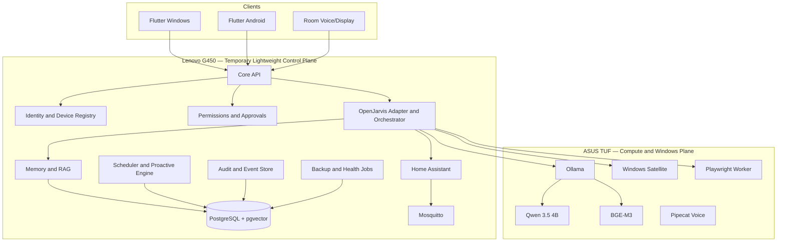

# BMO Personal AI OS — Master Architecture and Execution Plan

> **Canonical source of truth**
>
> **Status:** Locked baseline  
> **Plan version:** 1.3
> **Baseline date:** 2026-08-16
> **Owner:** Mahmoud  
> **Repository:** `MahmoudNagiubX/BMO-Personal-AI-OS`  
> **Required software subscription cost:** **0 EGP/month**  
> **Change policy:** Any architecture-changing decision must update this file and add or supersede an ADR.

The lossless original 3,404-line plan remains retained in `docs/archive/MASTER_PLAN_FULL.md.gz.b64`. Run `python scripts/restore_full_master_plan.py` to restore it for historical detail. This readable file is the active implementation contract.

---

# 0. How to Use This Plan

Before every implementation session, read:

1. `AGENTS.md`.
2. `docs/IMPLEMENTATION_STATUS.md`.
3. The active phase specification.
4. The relevant sections of this plan.
5. Every accepted or superseding ADR that affects the task.

Repository documents override remembered chat details. Record owner-reported hardware separately from physically verified evidence. Never silently alter a locked decision.

Architecture roadmap entries do not authorize implementation by themselves. A future capability begins only when the current status ledger and owner-approved task explicitly authorize its phase/gate.

Unless explicitly marked **out of scope**, every accepted capability in this plan is a mandatory long-term implementation target. “Future”, “planned later”, or a lettered phase describes sequencing, not optionality. BMO is not considered fully complete until all accepted in-scope capabilities are implemented, integrated, tested, and accepted. Robotics and physical agents are explicitly out of scope by owner decision dated 2026-08-16.

---

# 1. Product Vision

BMO Personal AI OS is a **local-first, multimodal, agentic personal operating system** for Mahmoud’s life, room, projects, and devices. It is not a voice-command demo and not a generic chatbot with a Jarvis prompt.

The final system should:

- Speak naturally in Arabic, English, and mixed Arabic-English.
- Maintain one approved owner identity, memory system, and permission model.
- Continue conversations across Windows, Android, browser, and room clients.
- Search approved files, notes, PDFs, repositories, tasks, and saved research.
- Search the public web, verify evidence, and save findings into the correct area.
- Open approved applications, projects, files, and websites.
- Start predefined development and productivity workflows.
- Monitor selected device and room conditions.
- Control room devices through Home Assistant.
- Manage tasks, reminders, routines, focus sessions, and project milestones.
- Perform bounded multi-step tasks with visible progress.
- Ask for approval before consequential actions.
- Learn through inspectable, correctable, exportable, and deletable memory.
- Provide useful proactive notifications without becoming intrusive.
- Work without a required paid API or monthly software subscription.
- Become context-aware through typed, provenance-backed, freshness-aware observations rather than hidden surveillance.
- Explain what evidence supports an important contextual claim and whether that evidence is stale, inferred, or conflicting.
- Degrade honestly when a source, satellite, or heavy-compute node is unavailable.

## Product promise

> **One identity, one memory system, one permission model, many clients, many scoped device agents, and one evidence-aware context architecture.**

## Non-goals

The system will not:

- Claim fictional human-level AGI.
- Give an LLM unrestricted shell, banking, password, or account access.
- Record all audio, screens, location, or browsing continuously.
- Replace medical, legal, or financial professionals.
- Run heavy AI inference on the desktop server’s GT 710.
- Automate every app through fragile screen clicking.
- Rebuild smart-home infrastructure already solved by Home Assistant.
- Fine-tune a large model before an evaluation dataset exists.
- Become a public multi-tenant SaaS.
- Require cloud models or paid services.
- Use continuous owner-camera surveillance, keylogging, unrestricted clipboard collection, or silent full browser-history ingestion.
- Claim universal personal WhatsApp automation through unsupported or fragile interfaces.
- Allow unrestricted social posting, autonomous purchasing, or unrestricted email deletion.
- Build or operate a physical robot, robotics platform, or embodied mobile agent. Robotics is out of BMO scope unless the owner explicitly reverses this decision through a future ADR.
- Perform hidden durable behavioral profiling or background retraining on the owner.
- Create multi-master control-plane authority.
- Treat model confidence as calibrated sensor certainty.
- Let a World State read model replace Home Assistant or another authoritative domain.

---

# 2. Locked Decisions

| Area | Locked decision |
|---|---|
| Product name | BMO Personal AI OS |
| Repository | `MahmoudNagiubX/BMO-Personal-AI-OS` |
| Repository style | Monorepo |
| Initial topology | Modular monolith plus independent device agents |
| Backend | Python 3.12 + FastAPI |
| Package management | `uv` with committed `uv.lock` |
| Main AI framework | OpenJarvis behind the product-owned adapter |
| OpenJarvis baseline | `v1.0.0`, commit `e97088f199cf86ea5f78de921772357d1f0d2cec` |
| OpenJarvis strategy | Pinned dependency; no direct imports outside adapter; no immediate fork |
| Architecture reference | Leon 2.0 patterns only; not the product base |
| Database | PostgreSQL |
| Vector search | pgvector |
| Sparse search | PostgreSQL full-text search initially |
| Retrieval | Hybrid dense + sparse; reranker only after measured need |
| Embeddings | BGE-M3 through Ollama |
| Primary generation/orchestration/vision model | Qwen 3.5 4B through Ollama |
| Larger local reasoning model | Deferred optional future extension; Qwen 3.5 9B is not an MVP or Phase 4 acceptance requirement |
| Heavy compute host | ASUS TUF F15, RTX 4050, 16 GB RAM, Windows |
| Always-on host | Lenovo G450 — temporary lightweight control plane defined by ADR-0007 |
| Server OS | Ubuntu Server 24.04.4 LTS AMD64, headless, no GUI |
| Server deployment | Docker Compose plus selected native host services when justified |
| Server local heavy LLM | Disabled |
| Cloud LLM | Optional, disabled, never required |
| Room control | Home Assistant Container |
| Device messaging | Mosquitto MQTT |
| Standard ESP firmware | ESPHome where possible |
| Voice framework | Pipecat |
| Wake word | openWakeWord; development phrase “Hey Jarvis” until final branding |
| VAD | Silero VAD |
| STT | faster-whisper multilingual; initial `medium`, benchmarked |
| Arabic TTS | sherpa-onnx with `vits-piper-ar_JO-kareem-medium` baseline |
| English TTS | Local medium Piper/VITS voice selected by benchmark |
| Product clients | Flutter for Windows and Android |
| Real-time client channel | WebSocket |
| Device/event channels | MQTT plus HTTPS/WebSocket |
| Authentication | Per-device identity and revocable scoped credentials |
| Remote access | LAN first; WireGuard preferred; Tailscale optional |
| Background jobs | Database-backed scheduler; no Redis in MVP |
| Browser automation | Playwright in isolated profile |
| Windows automation | Typed allowlisted Windows satellite tools |
| Dangerous actions | Explicit human approval |
| General shell | Never exposed to the main agent |
| External analytics | Disabled |
| Advanced context evidence | Product-owned typed observations and derived context claims with explicit provenance, authority, freshness, sensitivity, retention, and conflict semantics under ADR-0008 |
| World state authority | Contextual read model only; authoritative domains remain authoritative |
| Context fusion | Deterministic semantic fusion first; model inference never silently becomes verified authority |
| Raw contextual media | Raw audio/screen/camera and high-rate telemetry are not durable by default |
| Advanced capability rollout | Eleven accepted advanced capability families are mandatory long-term implementation targets and remain gated by prerequisites; robotics/physical agents are explicitly out of scope |
| Robotics / physical agents | Out of scope by owner decision dated 2026-08-16; no robot implementation, simulation, middleware, hardware, or control surface is planned |
| Required software cost | 0 EGP/month |
| Testing | Targeted tests during work; full suite at phase gates |
| License | Apache 2.0 for original code |

---

# 3. Hardware and Device Roles

## 3.1 Lenovo G450 — temporary lightweight always-on control plane

ADR-0007 is the active host decision. Established planning facts are a Core 2 Duo class CPU, 4 GB RAM, approximately 128 GB internal storage, physical RJ-45 Ethernet, and no useful AI GPU. Do not invent a more specific CPU, disk model/type, or firmware boot mode before physical verification.

### Operating baseline

- Ubuntu Server 24.04.4 LTS AMD64, headless, with no desktop GUI.
- Preserve Legacy BIOS/MBR compatibility in installation planning; verify actual boot mode physically.
- DHCP is acceptable during initial installation; a fixed address or DHCP reservation follows network inspection.
- SSH is required after installation; services are private-LAN only with no public port forwarding.
- Wired Ethernet is the expected network path.

### Responsibilities and limits

- Core API and lightweight orchestration, identity/device registry, permissions, approvals, scheduler, and audit/event coordination.
- Mosquitto MQTT, model gateway, ASUS TUF health routing, lightweight notifications/service discovery, and backup coordination.
- Home Assistant and PostgreSQL/pgvector only after measured storage, RAM, and load acceptance.
- Future low-rate current-state projections/freshness checks may be considered only after the same safety/resource admission gates; ADR-0008 does not authorize them now.
- No Qwen3.5 4B or BGE-M3 inference, local heavy LLM, heavy STT/TTS, heavy vision/indexing, high-rate perception/fusion, or unrestricted LLM shell.

### Resource and preservation policy

- Keep the installation minimal and headless; configure swap only after disk and RAM inspection, with no preselected final size.
- Admit Docker and services gradually from measured memory, disk, and load pressure.
- Require SMART monitoring, bounded logs, free-space thresholds, off-device backups, restore evidence, and 24-hour then seven-day stability gates.
- Do not add Redis, Kafka, Elasticsearch, Kubernetes, Prometheus, Grafana, or a local heavy LLM without an accepted ADR and measured need.

### Desktop PC status

The desktop PC and its ADR-0005 hardware record are preserved as historical evidence. It is a future control-plane upgrade or migration candidate, not an active required node, deployment authority, mandatory safety gate, or Phase 5B prerequisite. A Lenovo-to-desktop migration requires a new owner-approved ADR and a separate safety gate.

## 3.2 ASUS TUF — heavy compute and Windows execution plane

Responsibilities:

- Ollama model server.
- Qwen 3.5 4B as the initial primary generation, orchestration, and vision model. Qwen 3.5 9B is deferred.
- BGE-M3 embeddings when accepted by benchmark.
- Heavy STT, TTS, vision, perception, high-rate/expensive fusion when later authorized, and indexing.
- Windows device satellite.
- Isolated Playwright browser worker.
- Development, testing, benchmarking, and repository tools.

The TUF is not the always-on authority. When it is off, accepted Lenovo-hosted deterministic functions continue and full AI conversation may be reduced or unavailable until the TUF returns or is woken.

## 3.3 Samsung A54 — personal companion

The Flutter Android app provides:

- Text and voice conversation.
- Approval requests.
- Notifications and daily briefs.
- Quick note, image, and voice capture.
- Task and routine controls.
- Room and PC remote controls.
- Camera input only on explicit request.
- Location only through explicit permission and retention policy.

Future active perception, offline cache, optional local inference, and spatial/AR functions remain separately gated. Do not use unrestricted accessibility automation.

## 3.4 ESP32 and room nodes

Use ESPHome where possible. Room nodes may provide sensors, LEDs, relays, IR, microphones, speakers, and displays. Safety-critical loads require suitable hardware, electrical isolation, manual control, and explicit safety limits.

## 3.5 Historical branch boundary

ADR-0003 remains historical and ADR-0005 is superseded by ADR-0007. `phase-01/lenovo-foundation` remains audit history and must not be merged, rebased, force-pushed, rewritten, or reused. Physical Lenovo work begins from then-current `main` on a new `phase-01/lenovo-control-plane-foundation` branch after the current documentation-only architecture update is independently reviewed and owner-merged.

---

# 4. Repository and Open-Source Strategy

## Our repository owns

- Product identity and owner profile.
- Data contracts and database schema.
- Permission and approval engine.
- Device identity and protocols.
- Memory policy and review UX.
- Observation, provenance, freshness, authority, and future context contracts.
- OpenJarvis adapter.
- Model routing.
- Windows and mobile satellites.
- Home Assistant bridge.
- Voice orchestration.
- Product UI and animations.
- Audit, observability, backups, and runbooks.

## External components

- **OpenJarvis:** agent/runtime foundation behind `packages/openjarvis_adapter/`.
- **Leon:** design reference for smart/controlled/agent modes, profiles, satellites, layered memory, and bounded proactive behavior.
- **Home Assistant:** authoritative room automation system.
- **Pipecat:** real-time voice pipeline.
- **Ollama:** local model service.
- **faster-whisper, openWakeWord, Silero VAD, sherpa-onnx:** local voice stack.
- **Playwright:** isolated browser execution.

Future candidate integrations such as VS Code extension APIs, Windows capture/UI APIs, Jupyter, KiCad IPC, statistical anomaly libraries, Android local-inference runtimes, ARCore, or additional messaging platforms are **not** approved core dependencies by Plan v1.3. They must be introduced by the phase that needs them, pinned, license-recorded, security-reviewed, measured where relevant, and given rollback.

No non-commercial core dependency may be introduced without an ADR. Every model, voice, dataset, and copied implementation must be recorded in `docs/legal/LICENSE_INVENTORY.md`.

---

# 5. Technology Stack

## Backend and data

- Python 3.12.
- FastAPI and Pydantic.
- SQLAlchemy 2 and Alembic.
- PostgreSQL and pgvector.
- PostgreSQL full-text search.
- Local filesystem object storage initially.
- Database-backed scheduler.
- restic encrypted backups.

## AI

- OpenJarvis adapter.
- Ollama inference.
- Qwen 3.5 4B primary generation, conversation, orchestration, and vision model.
- Codex coding specialist; dedicated larger local reasoning models are deferred.
- BGE-M3 embeddings.
- No required cloud provider.

## Voice

- openWakeWord → Silero VAD → faster-whisper → Core API/agent → sherpa-onnx TTS.
- Pipecat coordinates streaming, interruption, and state transitions.
- Push-to-talk is implemented before wake word.

## Clients and device integration

- Flutter Windows and Android.
- WebSocket for live dialogue and UI state.
- MQTT for room/device events.
- HTTPS/WebSocket for authenticated high-level actions.
- ESPHome and Home Assistant.
- Native Windows satellite using typed Python/PowerShell wrappers.

## Deployment

- Docker Compose and selected services on the Lenovo only after measured safety and resource acceptance.
- Native Ollama on the ASUS TUF.
- Native Windows agent on the ASUS TUF.
- GitHub Actions CI.
- Secrets remain untracked and move to proper secret storage before production.

---

# 6. Architecture Principles

1. **Local first, not local only.** Paid/cloud providers are optional, visible, metered, and disabled by default.
2. **Central authority, distributed execution.** The Lenovo control plane owns accepted identity, permissions, scheduling, and audit responsibilities; the owning device executes each capability.
3. **Typed tools, never arbitrary shell.** Tools use strict schemas, allowlists, risk levels, scopes, and verified observations.
4. **Modular monolith first.** Split services only after measured operational need.
5. **Deterministic before agentic.** Known actions use reliable code; the LLM interprets intent and selects tools.
6. **No invisible learning.** Durable memories have source, confidence, sensitivity, scope, approval, retention, and edit/delete controls.
7. **Every action is attributable.** Store requester, client, run ID, tool, redacted arguments, authorization, approval, result, error, and reversal data.
8. **Fail closed.** Missing identity, scope, availability, approval, or validation means no action.
9. **Degraded states are honest.** Report when TUF, voice, browser, home, database, or a satellite is unavailable.
10. **Animations represent real states.** UI never fakes thinking or execution.
11. **Hardware is replaceable behind stable contracts.** Product-domain code does not depend on a specific chassis or hostname.
12. **Preserve hardware through bounded load.** Stock clocks, thermal targets, log rotation, storage monitoring, backups, and staged stability gates are mandatory.
13. **Evidence before context.** Decision-relevant contextual claims trace to typed source evidence and provenance.
14. **Authority is explicit.** A read model, fused claim, or model inference cannot silently replace the domain that owns the truth.
15. **Freshness is first-class.** Evidence quality, freshness state, and contradiction/conflict state are separate dimensions.
16. **Contradictions survive.** Conflicting observations remain inspectable; “newest wins” is not a universal truth policy.
17. **Bounded context, not raw surveillance.** Agent runtimes receive permission-filtered snapshots, not unlimited world history or continuous raw media.
18. **High-rate work stays near the owning hardware.** Heavy perception and high-rate processing do not run through the Lenovo LLM/control loop.

---

# 7. Target Architecture



The diagram above remains the currently authorized deployment architecture. The advanced context layer described below is a future logical/domain architecture, not a new set of deployed services.

## Core modules

Current/planned baseline domains:

```text
identity, devices, conversations, agent_runtime, model_gateway,
tools, permissions, approvals, memory, knowledge, tasks, routines,
scheduler, proactive, notifications, integrations, telemetry, audit, admin
```

Future advanced domain boundaries, created only when their authorized phase begins, may include:

```text
world_state, context_fusion, workspace_context, goals, anomalies,
communications, personalization, perception, engineering,
spatial, resilience
```

These names represent domain boundaries, **not mandatory processes, containers, microservices, APIs, or database tables**.

Each module owns its domain models, service interface, repository interface, routes, events, and tests only when that module’s phase authorizes its creation. Framework imports remain at boundaries.

## Capability ownership

Current baseline ownership:

- `core`: tasks, memory, profile, knowledge, scheduling.
- `windows`: applications, files, system telemetry, media, approved development workflows.
- `browser`: isolated web interaction.
- `home`: approved Home Assistant entities, scenes, and scripts.
- `mobile`: approved Android-local actions.
- `voice`: audio input/output state.
- `github`: scoped repository actions.

Future-gated ownership may extend to:

- `core`: world-state projection, deterministic semantic context fusion, bounded goals, anomaly evaluation, and approved personalization facts.
- `windows`: approved workspace metadata and explicit user-scoped screen-capture sessions through the Windows satellite.
- `home`: room observations while Home Assistant remains authoritative for selected entities and automation.
- `mobile`: approvals, opted-in notifications, explicit camera capture, permissioned location, bounded offline cache, and optional benchmark-gated local inference.
- `engineering`: approved build/test/notebook/simulation/CAD workflows through typed adapters.
- `communications`: scoped read/draft/send operations through supported official platform interfaces and the normal approval system.
- `spatial`: local spatial overlays tied to approved BMO entities; no permission bypass.

Disconnected devices automatically lose tool availability. The agent must never claim execution without a verified result.

## Advanced Context and Intelligence Layer

BMO will evolve beyond prompt-driven assistance through eleven accepted advanced systems. These are mandatory long-term implementation targets, but each starts only when its prerequisites and phase authorization are satisfied:

1. **Unified World State Engine** — permission-aware, time-aware contextual read model over authoritative domain state and typed observations.
2. **Sensor and Context Fusion** — deterministic, provenance-preserving derivation of higher-level context from multiple fresh observations.
3. **Active Workspace Context** — privacy-controlled understanding of approved Windows applications/workspaces and explicit capture sessions.
4. **Engineering and Scientific Copilot** — approved engineering workflows across code, repositories, notebooks, CAD/electronics tools, builds, tests, simulations, and experiment artifacts.
5. **Long-Horizon Goal Engine** — durable bounded goals, plan versions, dependencies, checkpoints, leases, budgets, cancellation, and controlled replanning.
6. **Active Visual Perception** — explicit one-shot or bounded screen/camera sessions converted into structured observations, with no raw-media retention by default.
7. **Anomaly and Event Intelligence** — deterministic thresholds/rules/trends first, with learned statistical methods only after measured need and evaluation.
8. **Communications Hub** — scoped read/draft/send connectors for supported official interfaces with exact previews, recipient resolution, approval, verification, and prompt-injection isolation.
9. **Adaptive Personalization** — explicit and reviewable owner preferences plus low-risk suggestion learning; no hidden durable behavioral profiling.
10. **Distributed Intelligence and Graceful Failover** — capability-aware degradation across Lenovo, TUF, Windows, and Android without silent cloud fallback or multi-master authority.
11. **Spatial / AR Interface** — planned mobile spatial layer using approved world-state overlays; no required cloud spatial service.

Robotics and physical agents are not one of the accepted systems. They are explicitly out of scope and are not a future phase or completion requirement.

These eleven systems share product-owned observation, provenance, freshness, sensitivity, retention, identity, permission, approval, audit, and degraded-state semantics. Their appearance here defines long-term product scope but does not authorize premature implementation.

### Advanced-system principles

- Every important contextual claim identifies evidence and freshness.
- Authoritative domain state is never silently replaced by model inference.
- Derived context preserves contradictions and uncertainty.
- Raw camera/screen/audio data is not stored by default.
- Long-running goals use persisted deterministic state, not unrestricted LLM loops.
- Consequential goal steps use the normal approval system.
- External message, webpage, screen, document, and sensor content is untrusted input.
- High-frequency sensor/vision processing remains off the Lenovo.
- Mobile-local model inference is an implementation choice that is benchmark-gated; the distributed-intelligence capability itself remains in scope.
- Home Assistant remains authoritative for room automation.
- Advanced systems do not bypass existing phase gates.

## Typed observation and evidence foundation — ADR-0008

The common future flow is conceptually:

```text
authoritative source / device
        ↓
typed observation adapter
        ↓
ObservationEnvelope
        ├──────────────→ audit/event evidence
        ↓
permission-aware world-state read model
        ↓
deterministic context fusion
        ↓
ContextClaim(s)
        ↓
bounded permission-filtered context snapshot
        ↓
conversation / planning / proactive reasoning
        ↓
typed tool proposal
        ↓
permission + approval + availability
        ↓
owning executor
        ↓
verified result / new observation
```

### ObservationEnvelope semantics

Exact code/schema is deferred, but the future product-owned contract must carry semantics for:

```text
observation identity + schema version
source kind + source device/integration identity
subject kind + subject identity
observed_at + received_at
validity/expiry
value + unit where applicable
evidence quality
confidence where meaningful
sensitivity + retention class
authority domain + authoritative/mirrored/inferred status
verification method
correlation/run identifiers where applicable
source reference / provenance
```

Do not mix three independent concepts:

```text
EvidenceQuality: verified | reported | inferred | estimated | unknown
FreshnessState:  fresh | aging | stale | expired | unknown
ConflictState:   consistent | conflicting | unresolved/unknown
```

A verified reading can be stale. A fresh observation can still be inferred. Conflicting evidence can contain multiple individually valid observations. These states must therefore remain separate.

### ContextClaim semantics

A future derived claim carries:

```text
claim identity + type + value
derived_at + valid_until
confidence when deterministically meaningful
supporting observation references
derivation/fusion rule or method + version
conflict/contradiction state
sensitivity
```

Model output may be an `inferred` observation. It is never silently upgraded to `verified` or authoritative.

### Authority rules

- World state is a **bounded contextual read model**, not a global mutable dictionary and not a second source of truth.
- Home Assistant remains authoritative for selected home entities.
- The Windows satellite is authoritative only for Windows telemetry/state it directly measures or verifies.
- External providers remain authoritative for provider-backed state such as calendar/message identifiers.
- Future goal state belongs to the goal domain.
- Accepted durable memory belongs to the memory domain.
- Vision or language-model guesses remain inference.
- Lower-authority evidence cannot silently overwrite verified authoritative state.
- Contradictions remain inspectable.

### Freshness, invalidation, and context snapshots

Every decision-relevant context value has a domain-specific freshness policy. Stale/unavailable sources degrade to stale/unknown rather than being presented as current truth. Source removal/revocation/offline status invalidates or downgrades dependent claims by deterministic policy.

Agent prompts receive small, purpose-bounded, permission-filtered snapshots rather than the whole context store or raw event history. Every decision-relevant field stays traceable to evidence outside the prompt.

### Context fusion

Semantic fusion starts with explicit, versioned deterministic rules. Time alignment, source lineage, freshness, contradiction penalties, cycle prevention, and confidence policy remain product code responsibilities. The LLM does not invent calibrated confidence.

---

# 8. Request and Action Lifecycle

1. Client sends a request with device credential and correlation ID.
2. Core authenticates device, owner, session, and scopes.
3. Relevant structured state, approved contextual snapshot, memory, and knowledge are retrieved.
4. Deterministic router chooses a direct workflow or bounded agent runtime.
5. Qwen 3.5 4B is the initial primary language, orchestration, and vision model; Codex owns coding-specialist workflows, while larger local reasoning models remain deferred.
6. Every proposed tool call is validated against schema, scope, risk, device availability, rate limits, and policy.
7. Consequential or critical actions create an approval preview.
8. The owning satellite executes the typed action.
9. The tool returns a structured observation/result with verification evidence.
10. The agent continues only within iteration, time, token, and action budgets.
11. The final response distinguishes verified facts, reported state, inference, staleness, conflicts, assumptions, and failures where relevant.
12. Audit and trace records are persisted with redaction.
13. Memory extraction occurs separately and may require review.

When the TUF is offline, deterministic server services continue. Full AI conversation may be unavailable or reduced; the core may optionally wake the TUF through Wake-on-LAN.

---

# 9. Model Architecture

## Initial primary model — Qwen 3.5 4B

Use for conversation, intent understanding, Arabic/English mixed interaction, explicit-request vision/screenshots, structured output, tool-call data, workflow selection, short/medium planning, and result summarization. Initial context: **8K**, benchmark up to **16K**.

## Deferred larger local reasoning model

Qwen 3.5 9B was investigated historically but is deferred: it is not required for MVP, Phase 4 acceptance, automatic download, or restoration. Codex is the coding specialist; deterministic product code owns permissions, approvals, validation, state machines, retries, execution, fusion policy, authority, and verification.

## Embeddings — BGE-M3

Use for multilingual personal memory, project knowledge, and document retrieval. Store model name, revision/digest, embedding dimension, chunking policy, and creation timestamp with each index version.

Do not use vector similarity as a substitute for authoritative current state. Semantic memory retrieval and device/world truth are distinct concerns.

## Routing rules

- Deterministic workflow before LLM.
- Qwen 3.5 4B is the initial active generation model; future larger-model routing requires a new measured architecture decision.
- No silent cloud fallback.
- Model output never equals execution proof.
- Tool observations and source evidence dominate hallucinated claims.
- Model inference never silently overrides authoritative state.
- The Lenovo server does not run the heavy model baseline.

## TUF benchmark gate

Confirm GPU VRAM with `nvidia-smi`, then benchmark load time, first-token latency, tokens/sec, RAM/VRAM, context size, Arabic, English, mixed language, tool calling, structured output, vision, and thermal behavior. Pin exact Ollama digests after acceptance.

Future sustained perception requires its own image-size/sample-rate/concurrency/thermal benchmark before acceptance.

---

# 10. Voice Architecture

```text
IDLE → WAKE_DETECTED → LISTENING → TRANSCRIBING → UNDERSTANDING
→ PLANNING → WAITING_FOR_APPROVAL → EXECUTING → SPEAKING → IDLE
```

Errors and degraded states are explicit.

Implementation order:

1. Push-to-talk client.
2. Streaming microphone transport.
3. VAD and end-of-turn detection.
4. Multilingual STT benchmark.
5. Core text/agent integration.
6. Local Arabic and English TTS benchmark.
7. Barge-in and interruption.
8. Wake word.
9. Echo handling and room-node optimization.

Audio is not stored by default. Any retention feature requires explicit purpose, consent, encryption, retention, and deletion policy. Future voice-state observations must follow ADR-0008 and must not imply raw-audio retention.

---

# 11. Memory and Knowledge System

Memory classes:

1. Owner profile.
2. Episodic memory.
3. Structured life data.
4. Knowledge/RAG.
5. Short-lived telemetry/context summaries.

Every durable memory includes source, source reference, confidence, sensitivity, scope, approval state, validity, timestamps, and retention metadata.

Memory is not World State. Memory stores accepted durable knowledge/history; future World State projects current contextual facts over fresh observations and domain authorities. A contextual inference does not become a durable memory automatically.

Write policy:

- Explicit owner statements may be saved with high confidence.
- Inferred memories enter pending review unless a low-risk policy allows them.
- Sensitive memories require clear purpose and controls.
- Contradictions preserve provenance and trigger review.
- Raw conversations are not automatically permanent facts.
- Derived context may become durable only through the normal memory/retention policy.

Retrieval:

- Filter by owner, scope, sensitivity, validity, and permission.
- Combine PostgreSQL full-text and pgvector results.
- Deduplicate and rerank only when measured value exists.
- Return source attribution.
- Keep retrieved untrusted instructions separate from system/tool authority.

The owner can inspect, edit, reject, delete, export, and trace memories to their sources.

---

# 12. Identity, Devices, Permissions, and Approval

Device enrollment:

- Generate a short-lived enrollment code locally.
- Device creates or receives its own credential.
- Owner approves name, type, scopes, and capabilities.
- Server stores credential hash and metadata, not plaintext reusable secrets where avoidable.
- Each device is independently revocable.

Risk levels:

| Level | Examples | Behavior |
|---|---|---|
| Read | status, search, calendar view | execute after scope check |
| Reversible | open app, change volume, light scene | execute and audit |
| Consequential | modify files, send message, publish GitHub change | exact preview and approval |
| Critical | delete data, security settings, purchases | strong dedicated flow |
| Forbidden autonomous | banking, passwords, dangerous hardware, unrestricted shell | never expose to normal agent |

Changed arguments invalidate an approval.

Future contextual reads are also permissioned. A conversation/session receives only observation/claim scopes allowed for its owner, client device, purpose, sensitivity, and current authorization.

---

# 13. Tool Platform and Satellites

A tool definition includes:

```text
name, version, owner device, description, JSON schema, required scopes,
risk level, approval rule, availability check, timeout, idempotency,
rate limit, audit redaction, verification method, reversal metadata
```

## Windows satellite MVP

- System status: CPU, RAM, GPU, disk, battery, network.
- Open allowlisted application or project.
- Search approved directories.
- Set volume and media state.
- Start approved scripts/workflows by ID.
- Return screenshots only on explicit request and policy approval.

Never accept arbitrary executable paths or arbitrary PowerShell from the model.

A later active-workspace extension may expose selected metadata from explicitly approved applications/workspaces. It must not add keylogging, unrestricted terminal history, unrestricted OCR, cookie/password access, or silent screen recording.

## Browser worker

- Isolated Playwright profile.
- Domain allow/deny policy.
- Download quarantine.
- No access to normal browser cookies/passwords.
- Web content is untrusted.
- Forms, sends, uploads, purchases, and account changes require approval.
- Do not silently ingest the owner’s normal browser history into world state.

## Home Assistant bridge

Home Assistant owns room state and automation. BMO exposes only selected entities, scenes, and scripts. Prefer high-level scenes over direct low-level relay manipulation. Keep physical manual control and safety limits.

Room-state observations may later feed the contextual read model, but the read model never becomes a second Home Assistant state machine.

## Future engineering tools

Engineering/scientific integrations must use typed allowlisted workflows with path validation, timeouts, output/artifact verification, prompt-injection handling, and normal risk/approval rules. Arbitrary shell disguised through notebooks, simulators, CAD tools, or build systems remains forbidden.

---

# 14. Core Data Domains

Initial PostgreSQL domains:

- owners and profiles;
- devices, credentials, scopes, and capabilities;
- sessions and conversations;
- agent runs, steps, tool calls, observations, and traces;
- permission decisions and approvals;
- memories, sources, embeddings, and knowledge documents/chunks;
- tasks, routines, schedules, events, and notifications;
- integrations and connection metadata;
- audit events;
- telemetry summaries and retention metadata.

ADR-0008 establishes future conceptual data needs without approving a schema migration. As their phases become authorized, data domains may add:

- typed observations, current contextual projections, source health, freshness, and provenance;
- derived context claims, conflicts, and fusion-rule versions;
- approved workspace sessions/artifact references;
- bounded goals, plan versions, steps, attempts, leases, checkpoints, and budgets;
- explicit perception sessions and derived observations;
- engineering experiment runs and artifact references;
- anomaly rules/events and owner feedback;
- communication identities/channel bindings/drafts/verified sends;
- personalization candidates, approved preferences, and rejection history;
- client synchronization versions/offline queue metadata;
- spatial entity and local-anchor references.

Exact table names, indexes, migrations, and retention durations are deferred to the phase that implements each domain.

Do not automatically store:

- raw camera frames or continuous video;
- raw desktop recordings;
- raw audio;
- unrestricted notification/message history;
- continuous location trails;
- unbounded high-rate sensor telemetry.

Use UUIDs for cross-device IDs and UTC ISO-8601 timestamps. Sensitive columns require explicit classification. Migrations require rollback/restore strategy and backup gates.

---

# 15. API and Event Contracts

Initial API families:

```text
/health, /ready, /version
/v1/auth, /v1/devices, /v1/conversations, /v1/agent-runs
/v1/tools, /v1/approvals, /v1/memory, /v1/knowledge
/v1/tasks, /v1/routines, /v1/notifications, /v1/integrations
/v1/audit, /v1/admin
```

WebSocket events represent real backend states, streamed text/audio references, tool proposals, approval requests, execution progress, errors, and degraded-service notifications.

MQTT topics are namespaced, authenticated, ACL-controlled, and versioned. High-level commands must not be unauthenticated raw text.

Possible future API/event families for world state, context, workspace, goals, perception, engineering, anomalies, communications, preferences, resilience, or spatial data are **not created or named as locked contracts by v1.3**. Their exact paths/events are defined only when their implementation phase begins.

---

# 16. Security and Privacy Baseline

Primary threats:

- Prompt injection from web, email, messages, files, screens, documents, and sensor-originated text.
- Compromised device or stolen token.
- Overpowered tool.
- Accidental destructive action.
- Public Ollama, MQTT, database, Home Assistant, or API exposure.
- Sensitive memory/context leakage.
- Malicious dependency or model update.
- Backup theft.
- Unsafe room hardware.
- Hallucinated execution claims.
- Context/source spoofing.
- Stale context used as current truth.
- Model inference elevated to authoritative state.
- Contradictory evidence silently overwritten.
- Sensitive workspace/location/notification context retained too broadly.
- Offline/multi-master conflicts creating false completion or state divergence.

Required mitigations:

- Per-device/source identity and scopes.
- Credential rotation and revocation.
- Private networking and authenticated channels.
- MQTT ACLs.
- Typed tools and allowlists.
- Static risk classification.
- Exact human approvals.
- Sandboxing and isolation.
- Output/result verification.
- Typed provenance, source authority, freshness, and conflict handling under ADR-0008.
- Permission-filtered bounded context snapshots.
- External contextual content treated as untrusted data, never system/tool authority.
- Structured redacted audit logs.
- Dependency/model pinning and license inventory.
- Secret scanning.
- Encrypted backups.
- Retention/deletion policies.
- Manual physical overrides.
- No public model endpoint.
- No raw audio/screenshot/camera retention by default.
- No consequential action based solely on an unverified derived claim when policy requires authoritative/directly verified evidence.

Create a detailed threat model before Phase 8 closes. Future sustained perception, mobile local inference, and cloud/spatial persistence each require an additional privacy/security architecture review before implementation.

---

# 17. Observability, Backups, and Recovery

Start lightweight:

- JSON structured logs.
- Correlation IDs.
- Health and readiness endpoints.
- Agent/tool trace viewer.
- Model latency and failure metrics.
- Device heartbeat and last-seen status.
- Scheduler and backup success records.
- Server CPU, memory, disk, SMART, temperature, fan, and service-health checks.

Future contextual observability should expose source health, freshness, claim invalidation, and degraded capability state without logging raw sensitive media/content.

Do not overload the Lenovo with a large monitoring stack during MVP.

Backups use restic encryption and a 3-2-1 direction where practical:

- Nightly database backup.
- Configuration and memory/document metadata backup.
- Separate backup of approved file store.
- Off-device copy required before production acceptance.
- Exclude caches, model weights, raw temporary audio/media, and reproducible artifacts.
- Test restoration regularly.

A backup is not accepted until restore is proven. Document failed-server, failed-TUF, corrupt-database, lost-device, power-loss, compromised-token, and later contextual-source failure recovery.

---

# 18. Testing Strategy

Layers:

- Unit tests for domain logic and policy.
- Contract tests for OpenJarvis adapter, device protocols, tools, model structured outputs, and integrations.
- Integration tests with PostgreSQL, MQTT, Home Assistant test environment, and simulated satellites.
- Security tests for authorization, approval replay/expiry, path traversal, allowlists, prompt injection, SSRF, data leakage, and public binding.
- End-to-end tests for text request, approval, Windows action, room scene, memory review, TUF offline, and recovery.
- Model/voice evaluation datasets for Arabic, English, mixed language, routing, tool calling, retrieval, latency, and hallucinated completion.
- Physical-server tests for inventory, SMART, memory, thermals, Ethernet, AC recovery, Docker restart, backup/restore, and stability.

Future advanced-context acceptance adds synthetic/gold tests appropriate to the capability:

- world-state sequences with exact fresh/stale/expired outcomes;
- source-authority preservation and source-removal invalidation;
- conflicting observations retained and visible;
- deterministic fusion precision/recall, temporal-window and cycle tests;
- sensitive-context scope filtering and bounded snapshot tests;
- workspace path/secret/session-lifecycle tests;
- goal crash/resume/idempotency/approval-expiry/cancellation/budget tests;
- active-perception consent, raw-media non-retention, schema, stale-frame, TUF-offline, and visible-text prompt-injection tests;
- communications recipient ambiguity, content/attachment approval invalidation, duplicate-send prevention, OAuth revocation, secret redaction, and prompt-injection tests;
- anomaly false-positive/false-negative evaluation before learned methods are accepted;
- personalization rejection/deletion/scope/explicit-preference-priority tests;
- distributed/offline reconciliation, duplicate request, version conflict, expired cache, and no-false-completion tests.

Run targeted tests frequently. Run the complete suite at each phase checkpoint. Never report a test as passing unless it actually ran in the current workspace or authoritative CI.

---

# 19. Repository Structure

```text
BMO-Personal-AI-OS/
├── AGENTS.md
├── README.md
├── START_HERE.md
├── apps/
│   ├── core_api/
│   ├── flutter_client/
│   └── admin_dashboard/
├── packages/
│   ├── openjarvis_adapter/
│   ├── domain/
│   ├── tool_contracts/
│   ├── event_contracts/
│   └── shared_models/
├── satellites/
│   ├── windows_agent/
│   ├── android_bridge/
│   └── room_agent/
├── integrations/
│   ├── home_assistant/
│   ├── browser/
│   ├── github/
│   ├── calendar/
│   ├── email/
│   └── smart_life_planner/
├── infrastructure/
│   ├── compose/
│   ├── home_server/
│   ├── tuf/
│   ├── networking/
│   └── backups/
├── docs/
│   ├── MASTER_PLAN.md
│   ├── IMPLEMENTATION_STATUS.md
│   ├── phases/
│   ├── adr/
│   ├── architecture/
│   ├── api/
│   ├── security/
│   ├── privacy/
│   ├── legal/
│   ├── runbooks/
│   └── phase_reports/
├── scripts/
└── tests/
```

This is a target structure, not a request to create empty directories. Future advanced domain folders are created only when their phase begins.

---

# 20. Execution Roadmap

## Phase 0 — Governance and source of truth

Repository rules, master plan, status ledger, ADRs, legal inventory, secret exclusions, Python tooling, CI, tests, and bounded agent prompts. No product code.

## Phase 1 — Lenovo G450 safety, Ubuntu Server, and network foundation

Verify exact hardware; test disk/SMART, memory, thermals, fans, battery, Ethernet, and power behavior; install Ubuntu Server 24.04.4 LTS AMD64 headlessly with Legacy BIOS/MBR compatibility retained in planning; harden SSH/private-LAN services; admit Docker and services only from measured resource evidence; configure log rotation, backups, and TUF Wake-on-LAN when later authorized; pass 24-hour then seven-day stability gates.

The historical `phase-01/lenovo-foundation` branch must not be merged or reused. Physical work starts from then-current `main` on a new `phase-01/lenovo-control-plane-foundation` branch.

## Phase 2 — Core platform skeleton

Modular-monolith boundaries, FastAPI health/version endpoints, PostgreSQL/pgvector Compose setup, Alembic, configuration, structured logging, correlation IDs, and CI integration tests. No agent behavior.

## Phase 3 — OpenJarvis compatibility spike

Pinned OpenJarvis release, adapter boundary, analytics disabled, trace/tool/model translation, and local request-flow contract proof. No direct imports elsewhere.

## Phase 4 — TUF model node

Install and benchmark Ollama, Qwen 3.5 4B, and BGE-M3; pin digests; test context, Arabic, English, mixed language, vision, tool-call data, thermals, and restart behavior. Qwen 3.5 9B remains deferred and is not a Phase 4 acceptance gate.

## Phase 5A — Software-only model-gateway contracts

Implement software-only gateway contracts for Qwen3.5 4B primary generation, BGE-M3 embeddings, provider/model identity, capability/modality matching, context/output budgets, health/availability, timeout/retry/circuit-breaker behavior, TUF offline/degraded state, and no cloud fallback without production server deployment.

## Lenovo G450 Safety Gate

After Phase 5A, stop product coding. Complete the Lenovo physical safety, resource, Ubuntu Server, backup/restore, and staged-stability acceptance before Phase 5B or Phase 6.

## Phase 5B — Model-gateway deployment acceptance

Deploy accepted gateway components to the Lenovo only after its safety gate; verify private bindings, TUF offline detection, Wake-on-LAN where supported, restart behavior, observability, and resource budgets.

## Phase 6 — Identity and device enrollment

Owner identity, device registration, enrollment codes, scoped credentials, revocation, heartbeat, capability inventory, and transport authentication.

## Phase 7 — Text-first conversation and clients

Conversation/session APIs, streaming WebSocket events, minimal authenticated text client, run history, cancellation, and verified response/trace behavior. Future observation-aware context integration must remain contract-only until its later prerequisite gates are authorized.

## Phase 8 — Tool, permission, approval, and audit platform

Typed tool registry, schemas, risk levels, scopes, availability, approvals, replay protection, budgets, audit events, sandbox policies, and detailed threat model. Include future observation/context scopes in the security model without implementing later domains.

## Phase 9 — Windows satellite

Enrollment, heartbeat, telemetry, application/project allowlists, approved file search, media controls, approved scripts by ID, verification, cancellation, and security tests.

### Planned later Phase 9B — Active Workspace Context

After the Phase 9 MVP is stable and the phase is explicitly authorized: read-only active application/workspace metadata, approved editor/project context, and explicit capture-session contracts. No keylogging, unrestricted terminal history, silent screen recording, or unrestricted workspace ingestion.

## Phase 10 — Push-to-talk voice

Pipecat streaming, VAD, faster-whisper benchmark, Arabic/English TTS benchmark, push-to-talk UI, interruption, latency metrics, and no-retention defaults.

## Phase 11 — Wake word and room voice

openWakeWord, echo handling, follow-up window, room microphone/speaker node, visible voice states, privacy mute, and false-activation evaluation.

## Phase 12 — Personal memory and RAG

Owner profile, memory classes, file ingestion, hybrid retrieval, provenance, review/edit/delete/export UX, retention, contradiction handling, and retrieval evaluation.

### Planned later Phase 12B — World State Foundation

After identity/session/event and memory/provenance foundations are stable and the phase is explicitly authorized: product-owned observation contracts, permission-aware current-state projection, source authority, freshness, provenance, conflict handling, and bounded context snapshots under ADR-0008. Exact schema/API is designed then, not now.

## Phase 13 — Home Assistant and MQTT

Home Assistant Container, Mosquitto ACLs, ESPHome baseline, selected entities/scenes/scripts, room sensor events, manual controls, and safe AI bridge.

### Planned later Phase 13B — Deterministic Context Fusion

After World State exists and the phase is explicitly authorized: versioned deterministic semantic fusion rules with temporal alignment, lineage, contradiction preservation, source invalidation, and synthetic evaluation.

## Phase 14 — Flutter Windows and Android product client

Shared identity/session model, text/voice, approvals, notifications, device status, memory review, tasks/routines, secure storage, offline/error states, and honest animations. Future explicit camera/spatial/offline-intelligence extensions remain separately gated.

## Phase 15 — Life modules

Tasks, reminders, routines, focus, projects, study, optional nutrition/fitness, calendar/email integrations with scoped permissions and synthetic tests.

### Planned later Phase 15B — Communications Hub

Begin after existing identity/approval/integration foundations are proven and the phase is explicitly authorized. Start with supported official APIs, unique contact/channel resolution, read/search, draft, exact preview, explicit send approval, send verification, rate limits, prompt-injection isolation, and duplicate-send prevention. Other platforms come later.

## Phase 16 — Proactive intelligence

Deterministic triggers first, notification budgets, quiet hours, cooldowns, owner feedback, bounded pulse model, no hidden continuous surveillance, and clear opt-outs.

### Planned later Phase 16B — Long-Horizon Goal Engine

Persisted bounded goal/plan state machine, dependencies, leases, checkpoints, hard model/tool/retry/notification/consequential-action budgets, cancellation, idempotency, and controlled replanning. Model planning proposes typed plan changes; it never owns an unrestricted autonomous loop.

### Planned later Phase 16C — Anomaly and Event Intelligence

Deterministic thresholds, debounce/cooldown, rates/trends, evidence-backed anomaly events, and owner feedback first. Statistical/learned anomaly detection is deferred until clean baseline data and false-positive/false-negative evaluation justify it.

### Planned later Phase 16D — Adaptive Personalization

Preference candidates, owner review, explicit/approved inferred preferences, temporary low-risk adaptation, rejection history, scope, deletion, and suggestion-frequency feedback. No hidden durable profile mutation or safety-policy weakening.

## Phase 17 — Browser and research tools

Isolated Playwright worker, web search, source capture, download quarantine, prompt-injection defenses, approval for consequential web actions, and project knowledge saving.

### Planned later Phase 17B — Engineering and Scientific Copilot

Typed approved engineering workflows spanning selected repository/CI/editor/notebook/simulation/CAD interfaces after security/tool prerequisites are stable and the phase is explicitly authorized. Every actual integration/dependency receives phase-specific review; arbitrary shell remains forbidden.

### Planned later Phase 17C — Active Visual Perception

Explicit Windows/Android perception sessions with capture consent, frame gating/sampling, structured inferred observations, prompt-injection treatment of visible text, TUF resource benchmarks, and raw-frame non-retention by default. Sustained/room-camera perception requires a separate privacy ADR.

## Phase 18 — Premium BMO/Jarvis-inspired UX

State-driven visualizer, tool/action timeline, device topology, model/voice state, room dashboard, memory viewer, accessibility, and performance optimization. UI follows real backend state.

### Planned later Phase 18B — Spatial / AR Interface

Advanced mobile client feature after the product UI is stable and the phase is explicitly authorized. Read-only overlays and local anchors first; spatial controls still pass normal permission/approval. Any cloud anchor/persistent room-map design requires a later ADR/privacy decision.

## Phase 19 — Hardening, backup, recovery, and daily-use stabilization

Threat-model closure, restore drills, power-loss recovery, lost-device revocation, database migration recovery, dependency/model updates, seven-day stability, performance tuning, and tagged release.

### Planned later Phase 19B — Distributed Intelligence and Graceful Failover

Formalize capability-degradation matrices, encrypted bounded offline cache, queued pending requests, reconciliation/version conflicts, duplicate prevention, and no false completion while executors are offline. Android-local inference remains an optional implementation technique that is benchmark- and ADR-gated and never becomes a second authority.

No phase or lettered extension begins until its prerequisite gate, phase report/status ledger, and explicit owner authorization permit it. Lettered extensions are required long-term roadmap placements for their accepted capabilities; they are not permission to start early.

---

# 21. Phase Execution Rules

Every phase defines:

- Goal and user value.
- Allowed and forbidden scope.
- Architecture/contracts affected.
- Security/privacy impact.
- Tasks in implementation order.
- Targeted tests.
- Full validation command.
- Deployment, migration, and rollback.
- Acceptance criteria.
- Phase report.
- Exactly one next authorized task.

Codex is the default implementation specialist. Independent review is read-only and mandatory before owner merge. Agents must not edit the same files concurrently, and Mahmoud remains the sole architecture and merge authority.

A future capability’s appearance in this plan is not implementation authorization. Accepted in-scope capabilities remain mandatory long-term targets unless the owner explicitly de-scopes or supersedes them.

---

# 22. Git and Coding Workflow

- Branch: `phase-XX/short-description`.
- Commit: `<type>(phase-XX): <imperative summary>`.
- Small intentional commits.
- No unrelated formatting or refactors.
- No force-push, amend, rebase, branch deletion, or merge without explicit owner authorization.
- PR includes scope, why, security/data impact, commands, outcomes, migration, rollback, and documentation impact.
- `uv.lock` and model/dependency pins are reviewed artifacts.

Standard checks:

```bash
uv sync --group dev --locked
uv run python scripts/check.py
uv run pre-commit run --all-files
```

---

# 23. Deployment Topology

## Lenovo G450

Initial efficient runtime set:

1. Core API modular monolith and lightweight orchestration.
2. Mosquitto MQTT, model-gateway/TUF health routing, notifications, and backup coordination.
3. PostgreSQL/pgvector only after storage, RAM, and load gates.
4. Home Assistant only after measured resource acceptance.
5. Reverse proxy only when required by a later accepted design.

ADR-0008 does not add any item to this runtime set. A future low-rate context projection is admitted only by its later phase and measured resource evidence.

Resource rules:

- Keep Ubuntu Server headless and start services one group at a time from measured memory, CPU, storage, and temperature evidence.
- Keep container and application logs rotated.
- Do not accept swap thrashing as normal operation.
- Keep adequate SSD free space.
- Do not place critical data on one disk only.
- Do not set a final swap size before disk/RAM inspection or accept a local AI model on the Lenovo.
- Do not route raw high-rate vision/sensor streams through the Lenovo context/LLM path.

## ASUS TUF

- Ollama bound to localhost or a trusted private interface only.
- Windows satellite as a managed native service.
- Voice and browser workers isolated by process/profile.
- Heavy future perception/high-rate processing stays here or on the owning device when later authorized.
- No inbound public Internet exposure.

## Remote access

LAN first. Add WireGuard only after identity, scopes, TLS/private networking, and revocation are proven. Tailscale may be optional convenience, never a hidden dependency.

---

# 24. Performance and Reliability Targets

Initial targets, revised only by measurement:

| Metric | Target |
|---|---|
| Core local health response | <100 ms |
| Deterministic command start | <1.5 s |
| Warm 4B first token | <3 s |
| Wake acknowledgement | <800 ms |
| End-of-speech detection | <700 ms |
| Approved stable tool success | >95% |
| Unauthorized consequential actions | 0 |
| Memory retrieval precision on gold set | >85% |
| Home-network service uptime after stabilization | >99% |
| Normal UI animation | 60 FPS target |
| Backup success | >99%, alert on failure |
| Normal sustained server CPU temperature | <75 °C target |
| Production server stability gate | 24 hours, then 7 days |

Document actual performance honestly when hardware cannot meet a target.

No additional advanced-system latency/confidence/AR targets are locked in v1.3. Those targets must come from measurement in the phase that implements each capability.

---

# 25. Cost Policy

The required software stack remains free:

- Ubuntu Server 24.04.4 LTS, Docker, PostgreSQL, pgvector.
- Python, FastAPI, Flutter.
- OpenJarvis, Ollama, Qwen, BGE-M3.
- Home Assistant, Mosquitto, ESPHome.
- Pipecat, faster-whisper, sherpa-onnx, openWakeWord.
- restic.

Real indirect costs are electricity, Internet, hardware wear, optional upgrades, UPS, and room hardware. Optional paid LLM, TTS, search, SMS, maps, hosting, monitoring, communications, or spatial services remain disabled by default and require a cost ceiling, privacy disclosure, usage meter, and local/degraded behavior.

ADR-0008 introduces no required subscription or dependency.

---

# 26. Deferred Decisions and Gates

| Decision | Default | Gate |
|---|---|---|
| Final public product name | BMO Personal AI OS | Before public branding |
| Final wake phrase | “Hey Jarvis” development only | Voice benchmark and branding review |
| Exact English TTS voice | Medium local Piper/VITS | Voice quality benchmark |
| Permanent PostgreSQL disk placement | SSD after checks | SMART, load, backup, restore, free-space evidence |
| RAM upgrade timing | 16 GB recommended | Baseline measurements or before full sustained stack |
| Larger SSD timing | 500 GB+ recommended | Capacity and write-growth measurements |
| UPS purchase | Recommended | Before reliance on graceful outage behavior |
| Remote provider | LAN first, WireGuard preferred | Proven off-LAN need |
| Reranker model | None | Retrieval metrics show need |
| Redis/queue | None | Measured concurrency/reliability problem |
| Raspberry Pi room node | None | Dedicated room voice/display phase |
| Cloud model fallback | Disabled | Explicit owner ADR |
| Fine-tuning | None | Evaluation data and clear measured benefit |
| Camera monitoring | Disabled | Specific use case and privacy ADR |
| Speaker identification | Disabled | Consent and security review |
| Concrete world-state DB schema/API | None | Planned Phase 12B design + migration/rollback review |
| Sustained screen/camera perception | Disabled | Explicit use case + privacy ADR + TUF benchmark |
| Robotics / physical agents | Out of scope | Only an explicit future owner scope reversal plus a new ADR may reintroduce it |
| Learned anomaly model | None | Clean baseline + gold evaluation + measured benefit |
| Mobile local LLM | Disabled | Samsung A54 resource/battery/thermal benchmark + ADR |
| Spatial/AR implementation | Planned | Phase 18B authorization + supported-device/performance/privacy review |
| Cloud spatial anchors / persistent room map | Disabled | Separate architecture/privacy ADR |
| Additional communications platforms | None beyond phase-selected integrations | Supported official API + scopes/terms/security/approval review |

---

# 27. Milestones

- **M0:** Repository and governance validated.
- **M1:** Lenovo G450 safety and Ubuntu Server foundation stable, secure, recoverable, and restore-tested.
- **M2:** Core API and database reproducible.
- **M3:** OpenJarvis adapter proven.
- **M4:** Local models benchmarked and routed.
- **M5:** Secure text conversation and device identity.
- **M6:** Typed approvals and Windows actions.
- **M7:** Push-to-talk voice.
- **M8:** Memory/RAG with user review.
- **M9:** Home Assistant room control.
- **M10:** Windows/Android product client.
- **M11:** Life and proactive modules.
- **M12:** Browser research and premium interface.
- **M13:** Restore-tested daily-use release.

The advanced milestones below do not gate the first daily-use release, but they **do gate full BMO completion** because their accepted capabilities are mandatory long-term targets:

- **M14:** Context-aware BMO — world state, source freshness/provenance, and approved workspace context.
- **M15:** Goal-aware BMO — durable bounded goals, checkpoints, and anomaly intelligence.
- **M16:** Engineering-aware BMO — approved engineering workflows and explicit active perception.
- **M17:** Spatial BMO — permissioned mobile spatial overlays tied to verified current state.
- **M18:** Resilient BMO — cross-device offline/degraded/reconciliation behavior proven.

---

# 28. Definition of Done

A task is done only when:

- Scope and acceptance criteria are satisfied.
- Typed implementation and targeted tests exist where implementation is in scope.
- Relevant checks pass.
- Security/data impact is reviewed.
- Documentation and status are updated.
- Migration and rollback are clear.
- No later-phase work was introduced.

A phase is done only when:

- All tasks are accepted.
- Full suite and security checks pass.
- Deployment/stability evidence exists where relevant.
- Backup/rollback is tested where relevant.
- Phase report records actual commands and results.
- Status authorizes exactly one next phase or task.

The first daily-use release is done only when:

- Text, voice, identity, memory, approvals, Windows actions, and room control work together.
- TUF-offline deterministic behavior is honest and reliable.
- No required paid service exists.
- Lost-device, power-loss, database restore, and token revocation are tested.
- Private data can be inspected, exported, corrected, and deleted.
- Lenovo control-plane seven-day stability passes.

Full BMO is done only when every accepted in-scope capability in this Master Plan, including all eleven advanced systems, has an implemented, integrated, tested, security/privacy-reviewed, resource-validated, and accepted form. Explicitly out-of-scope items such as robotics/physical agents are not completion requirements.

A future advanced capability is accepted only when, as applicable:

- it emits typed observations/results with provenance;
- evidence quality, freshness, source authority, and conflict semantics are explicit;
- sensitivity and retention are explicit;
- permissions/approvals are explicit;
- degraded/offline state is visible;
- raw sensitive media is not retained by default;
- deterministic policy cannot be bypassed by model output;
- real actions have verification evidence;
- synthetic/gold tests exist;
- prompt-injection boundaries are tested;
- resource behavior is measured on the owning hardware;
- rollback is documented.

A one-off model demo is not completion evidence.

---

# 29. Prohibited Shortcuts

- Do not ask an agent to build the whole master plan in one implementation task.
- Do not expose arbitrary shell or PowerShell.
- Do not import OpenJarvis outside the adapter.
- Do not bypass approvals to improve demo speed.
- Do not store secrets or real personal fixtures in Git.
- Do not bind internal services publicly.
- Do not fake tool completion or UI state.
- Do not silently enable cloud providers, analytics, recording, location, or camera.
- Do not add infrastructure because it is fashionable.
- Do not skip restore testing.
- Do not optimize animation before the core is trustworthy.
- Do not overclock the always-on server.
- Do not assume recommended upgrades are already installed.
- Do not merge, rebase, force-push, rewrite, or reuse the historical Lenovo branch.
- Do not implement the eleven advanced capability families merely because Plan v1.3 documents them; wait for their prerequisite phases and explicit authorization.
- Do not create a second source of truth in World State.
- Do not persist every observation or high-rate sensor/media stream indefinitely.
- Do not silently overwrite contradictory evidence.
- Do not let the LLM invent calibrated sensor confidence or promote inference to authority.
- Do not give the LLM continuous raw access to sensors, screens, messages, cameras, files, or the shell.
- Do not use unrestricted autonomous goal loops.
- Do not use hidden behavioral learning to mutate durable preferences or safety policy.
- Do not create multi-master state across Lenovo/TUF/mobile.
- Do not introduce robotics/physical-agent scope, robot simulation, robot middleware, robot hardware, or robot-control interfaces unless the owner explicitly reverses the out-of-scope decision through a future ADR.
- Do not treat an anomaly score as proof of compromise or failure.
- Do not use AR/spatial UI to bypass normal permissions or approvals.

---

# 30. Initial Configuration Targets

```yaml
models:
  provider: ollama
  generation: qwen3.5:4b
  embeddings: bge-m3
  context_tiers: [4096, 8192, 16384]
  maximum_test_context: 32768

privacy:
  cloud_models_enabled: false
  external_analytics_enabled: false
  raw_audio_storage_enabled: false
  screen_capture_storage_enabled: false
  camera_monitoring_enabled: false

execution:
  arbitrary_shell_tool: false
  typed_tools_only: true
  approvals_required_for_consequential_actions: true

advanced_context:
  architecture_adr: ADR-0008
  implementation_authorized: false
  authoritative_domains_preserved: true
  raw_media_retention_default: false
  deterministic_fusion_first: true
  mobile_local_inference_enabled: false
  robotics_in_scope: false
  spatial_ar_enabled: false

home_server:
  host: lenovo_g450
  operating_system: ubuntu_server_24_04_4_lts
  architecture: amd64
  headless: true
  desktop_gui: false
  docker_admission: measured_resource_gate
  wired_ethernet: true
  heavy_local_llm: false
  docker_log_rotation: true
  smart_monitoring: true
  private_lan_only: true
  stability_gate_hours: 24
  final_stability_gate_days: 7

future_hosts:
  desktop_pc_upgrade_candidate: true

historical_branches:
  lenovo_foundation_reusable: false
```

---

# 31. Source and Version Policy

Before every upgrade or new external integration:

- Verify official repository, release, image, API, and model sources.
- Record exact version, commit, model digest/checksum, and license where applicable.
- Review changelog, platform terms, security, privacy, and data impact.
- Run compatibility, regression, retrieval, voice, context, and performance tests as relevant.
- Document migration and rollback.
- Never follow a moving development branch in production.
- Do not accept a research-proposal technology choice as a dependency until the owning phase validates it.

---

# 32. Trust Contract

BMO will be:

- Owned by Mahmoud.
- Local-first and free to operate without subscriptions.
- Available for deterministic functions through the Lenovo control plane.
- Powerful when the ASUS TUF is online.
- Built around OpenJarvis but not trapped inside it.
- Connected to the room through Home Assistant.
- Connected to devices through permissioned satellites.
- Multilingual and voice-capable.
- Able to remember transparently.
- Able to understand current context through evidence rather than hidden surveillance.
- Able to distinguish authoritative, reported, inferred, stale, and conflicting information.
- Able to act only with bounded authority.
- Proactive but controllable.
- Visually expressive but technically honest.
- Developed in phases with tests, audit, backups, rollback, and hardware-preservation controls.

The priority is not merely to look intelligent. The priority is to become **trustworthy, useful, and structurally capable of increasing intelligence safely**.

> Intelligence may propose and interpret; deterministic product code owns authority, safety, execution, and proof.

---

# 33. Current Phase

Phase 4 and Phase 5A are closed. PR #10 merged ADR-0007 at `e8a2ddd6ecb4dac75b09fe6d96ec3071d270de41`. PR #11 merged the repository-cleanup gate at `09593cc1874d997fb4888db326068112cf0afd7f`; that gate is closed.

ADR-0008 and Plan v1.3 accept the future typed observation/provenance/world-state context architecture and eleven bounded advanced capability families as mandatory long-term product scope, while robotics/physical agents are explicitly out of scope. This does not implement a world-state service, change the database/API, add dependencies, deploy anything, or authorize a later phase.

The current mandatory physical boundary remains the **Lenovo G450 Safety Gate and Ubuntu Server 24.04.4 LTS AMD64 Foundation**. Phase 5B is blocked and Phase 6 is unauthorized until the Lenovo gate passes.

---

# 34. First Implementation Order

The exact current order is:

1. Independently review and owner-merge the documentation-only Plan v1.3 / ADR-0008 architecture update.
2. Create `phase-01/lenovo-control-plane-foundation` from then-current `main`; never reuse the historical Lenovo branch.
3. Verify Lenovo hardware, storage, memory, cooling, battery, Ethernet, and power behavior.
4. Install and harden Ubuntu Server 24.04.4 LTS AMD64 headlessly with SSH and private-LAN services.
5. Configure only resource-admitted Docker/services, bounded logs, LAN identity, backups, restore, and Wake-on-LAN when later authorized.
6. Pass 24-hour and seven-day Lenovo stability gates.
7. Complete Phase 5B gateway deployment acceptance.
8. Build identity and device enrollment.
9. Build text-first local conversation.
10. Build tool, permission, approval, and audit platform.
11. Build Windows satellite.
12. Add push-to-talk voice.
13. Add wake word and room voice.
14. Build memory/RAG and review controls.
15. Add Home Assistant/MQTT.
16. Add Flutter Windows/Android product client.
17. Add life modules.
18. Add proactive intelligence.
19. Add browser/research tools.
20. Add premium UX.
21. Harden, restore-test, and stabilize the first daily-use release.
22. Continue through every planned later in-scope advanced capability until all eleven advanced systems are implemented and full-system completion criteria pass.
23. After full BMO completion, continue with tuning, optimization, reliability, UX refinement, hardware upgrades, and newly owner-approved capabilities.

No advanced-system implementation is inserted ahead of the Lenovo gate or its existing prerequisites. Robotics/physical agents are not part of this implementation order.

---

# 35. Plan Change Log

| Version | Date | Change |
|---|---|---|
| 1.0 | 2026-07-31 | Initial locked architecture and execution plan |
| 1.1 | 2026-08-07 | Superseded the Lenovo control-plane decision; adopted the Ryzen 5 3600 desktop home server; added exact owner-reported hardware, Xubuntu server-style baseline with XFCE available, storage and upgrade policy, two-year preservation controls, revised topology, deployment gates, roadmap, milestones, configuration, and recovery rules |
| 1.2 | 2026-08-15 | Superseded ADR-0005 with ADR-0007; restored the Lenovo G450 as the temporary lightweight control plane, retained the ASUS TUF heavy-compute role, deferred the desktop PC as a future upgrade candidate, adopted Ubuntu Server 24.04.4 LTS headless, and made the Lenovo G450 Safety Gate the next mandatory step after Phase 5A. |
| 1.3 | 2026-08-16 | Accepted ADR-0008 and the Advanced Context and Intelligence roadmap: introduced typed observation/provenance/freshness/authority semantics, separated evidence quality from freshness and conflict state, defined World State as a non-authoritative contextual read model, established eleven accepted advanced capability families as mandatory long-term implementation targets, explicitly removed robotics/physical agents from BMO scope by owner decision, and deferred concrete schemas/APIs/dependencies/privacy-sensitive implementation until their prerequisite phases. The Lenovo Safety Gate remains the current mandatory physical boundary. |