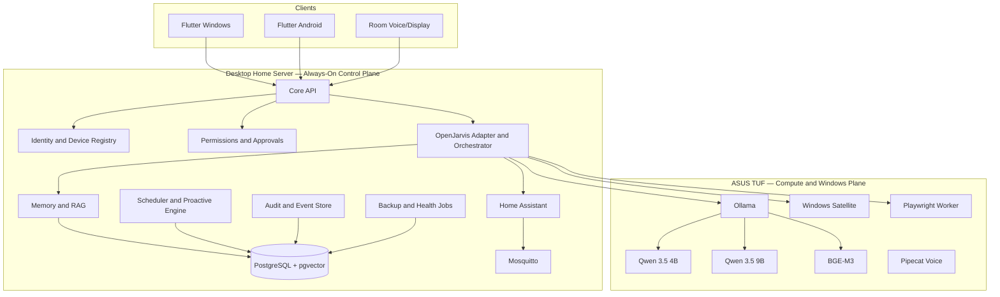

# BMO Personal AI OS — Master Architecture and Execution Plan

> **Canonical source of truth**
>
> **Status:** Locked baseline  
> **Plan version:** 1.1  
> **Baseline date:** 2026-08-07  
> **Owner:** Mahmoud  
> **Repository:** `MahmoudNagiubX/BMO-Personal-AI-OS`  
> **Required software subscription cost:** **0 EGP/month**  
> **Change policy:** Any architecture-changing decision must update this file and add or supersede an ADR.

The lossless original 3,404-line plan remains retained in `docs/archive/MASTER_PLAN_FULL.md.gz.b64`. Run `python scripts/restore_full_master_plan.py` to restore it for historical detail. This readable file is the active implementation contract.

---

# 0. How to Use This Plan

Before every implementation session, read:

1. `AGENTS.md`.
2. `docs/IMPLEMENTATION_STATUS.md`.
3. The active phase specification.
4. The relevant sections of this plan.
5. Every accepted or superseding ADR that affects the task.

Repository documents override remembered chat details. Record owner-reported hardware separately from physically verified evidence. Never silently alter a locked decision.

---

# 1. Product Vision

BMO Personal AI OS is a **local-first, multimodal, agentic personal operating system** for Mahmoud’s life, room, projects, and devices. It is not a voice-command demo and not a generic chatbot with a Jarvis prompt.

The final system should:

- Speak naturally in Arabic, English, and mixed Arabic-English.
- Maintain one approved owner identity, memory system, and permission model.
- Continue conversations across Windows, Android, browser, and room clients.
- Search approved files, notes, PDFs, repositories, tasks, and saved research.
- Search the public web, verify evidence, and save findings into the correct area.
- Open approved applications, projects, files, and websites.
- Start predefined development and productivity workflows.
- Monitor selected device and room conditions.
- Control room devices through Home Assistant.
- Manage tasks, reminders, routines, focus sessions, and project milestones.
- Perform bounded multi-step tasks with visible progress.
- Ask for approval before consequential actions.
- Learn through inspectable, correctable, exportable, and deletable memory.
- Provide useful proactive notifications without becoming intrusive.
- Work without a required paid API or monthly software subscription.

## Product promise

> **One identity, one memory system, one permission model, many clients, and many scoped device agents.**

## Non-goals

The early system will not:

- Claim fictional human-level AGI.
- Give an LLM unrestricted shell, banking, password, or account access.
- Record all audio, screens, location, or browsing continuously.
- Replace medical, legal, or financial professionals.
- Run heavy AI inference on the desktop server’s GT 710.
- Automate every app through fragile screen clicking.
- Rebuild smart-home infrastructure already solved by Home Assistant.
- Fine-tune a large model before an evaluation dataset exists.
- Become a public multi-tenant SaaS.
- Require cloud models or paid services.

---

# 2. Locked Decisions

| Area | Locked decision |
|---|---|
| Product name | BMO Personal AI OS |
| Repository | `MahmoudNagiubX/BMO-Personal-AI-OS` |
| Repository style | Monorepo |
| Initial topology | Modular monolith plus independent device agents |
| Backend | Python 3.12 + FastAPI |
| Package management | `uv` with committed `uv.lock` |
| Main AI framework | OpenJarvis behind the product-owned adapter |
| OpenJarvis baseline | `v1.0.0`, commit `e97088f199cf86ea5f78de921772357d1f0d2cec` |
| OpenJarvis strategy | Pinned dependency; no direct imports outside adapter; no immediate fork |
| Architecture reference | Leon 2.0 patterns only; not the product base |
| Database | PostgreSQL |
| Vector search | pgvector |
| Sparse search | PostgreSQL full-text search initially |
| Retrieval | Hybrid dense + sparse; reranker only after measured need |
| Embeddings | BGE-M3 through Ollama |
| Main model | Qwen 3.5 9B quantized Ollama build |
| Fast model | Qwen 3.5 4B quantized Ollama build |
| Heavy compute host | ASUS TUF F15, RTX 4050, 16 GB RAM, Windows |
| Always-on host | Desktop home server defined by ADR-0005 |
| Server OS | Ubuntu Server 24.04.4 LTS, 64-bit, headless |
| Server deployment | Docker Compose plus selected native host services when justified |
| Server local heavy LLM | Disabled |
| Cloud LLM | Optional, disabled, never required |
| Room control | Home Assistant Container |
| Device messaging | Mosquitto MQTT |
| Standard ESP firmware | ESPHome where possible |
| Voice framework | Pipecat |
| Wake word | openWakeWord; development phrase “Hey Jarvis” until final branding |
| VAD | Silero VAD |
| STT | faster-whisper multilingual; initial `medium`, benchmarked |
| Arabic TTS | sherpa-onnx with `vits-piper-ar_JO-kareem-medium` baseline |
| English TTS | Local medium Piper/VITS voice selected by benchmark |
| Product clients | Flutter for Windows and Android |
| Real-time client channel | WebSocket |
| Device/event channels | MQTT plus HTTPS/WebSocket |
| Authentication | Per-device identity and revocable scoped credentials |
| Remote access | LAN first; WireGuard preferred; Tailscale optional |
| Background jobs | Database-backed scheduler; no Redis in MVP |
| Browser automation | Playwright in isolated profile |
| Windows automation | Typed allowlisted Windows satellite tools |
| Dangerous actions | Explicit human approval |
| General shell | Never exposed to the main agent |
| External analytics | Disabled |
| Required software cost | 0 EGP/month |
| Testing | Targeted tests during work; full suite at phase gates |
| License | Apache 2.0 for original code |

---

# 3. Hardware and Device Roles

## 3.1 Desktop home server — always-on control plane

ADR-0005 is the accepted host decision.

### Owner-reported hardware baseline

- AMD Ryzen 5 3600, 6 cores / 12 threads.
- Gigabyte B550 AORUS ELITE motherboard.
- 8 GB system RAM.
- NVIDIA GeForce GT 710 with 2 GB VRAM.
- 128 GB SSD.
- Approximately 350 GB HDD.
- Cooler Master 600 W power supply.

These specifications are accepted for planning but remain subject to direct inventory verification before physical deployment.

### Operating baseline

- Ubuntu Server 24.04.4 LTS, 64-bit, without a desktop environment.
- Hostname `bmo-control` unless changed by a later ADR.
- Wired Ethernet as the normal production network path.
- Docker Compose for infrastructure and selected product services.
- Stock CPU settings; no overclock or PBO.
- Private-network service bindings only.

### Responsibilities

- Core API and orchestration.
- Identity, device registry, permissions, approvals, audit, and scheduler.
- PostgreSQL/pgvector after storage and load gates pass.
- Home Assistant Container.
- Mosquitto MQTT.
- Model gateway, TUF health routing, and optional Wake-on-LAN.
- Lightweight retrieval and notifications.
- Encrypted backup jobs.
- Private network service discovery.

Do not add Redis, Kafka, Elasticsearch, Kubernetes, Prometheus, Grafana, or a local heavy LLM during MVP without an accepted ADR and measured need.

### GT 710 policy

The GT 710 is retained for display, firmware configuration, and recovery access. It is not an AI accelerator. The Ryzen 5 3600 has no integrated graphics, so removing the card requires a separately verified headless-boot and recovery plan.

### Storage policy

- The 128 GB SSD initially hosts Ubuntu, Docker, configuration, and active services after SMART and free-space checks.
- The HDD may hold non-critical archives and one backup copy, but it must never be the only copy of critical data.
- PostgreSQL placement is accepted only after SMART, write-load, free-space, backup, and restore checks.
- Model weights remain on the ASUS TUF unless an ADR changes the model topology.

### Two-year preservation policy

A two-year always-on service window is accepted. Continuous light-to-moderate server use is not considered harmful by itself; the primary wear risks are storage, fans, dust, power quality, and sustained heat.

Required controls:

- Keep CPU operation at stock; no overclock or PBO.
- Target sustained CPU temperature below 75 °C during normal server load.
- Verify fan operation and clean dust every 3–6 months.
- Monitor SSD/HDD SMART health and temperatures.
- Alert on reallocated, pending, or uncorrectable sectors.
- Configure Docker and application log rotation.
- Use Ethernet for the production path.
- Use a quality surge protector and prefer a UPS.
- Configure automatic recovery after AC power returns.
- Keep off-device backups and perform restore drills.
- Pass a 24-hour stability gate, then a seven-day gate before production acceptance.

### Recommended upgrades

1. Increase RAM from 8 GB to at least 16 GB before sustained operation of the full database, Home Assistant, memory/RAG, and multiple product containers.
2. Add or replace storage with a 500 GB or larger SSD for database growth, indexes, logs, updates, and comfortable free space.
3. Add a UPS for graceful shutdown and protection from repeated outages.

The platform retains a future CPU, RAM, and storage upgrade path. Exact processor compatibility must be checked against the motherboard revision and installed BIOS before purchase.

## 3.2 ASUS TUF — heavy compute and Windows execution plane

Responsibilities:

- Ollama model server.
- Qwen 3.5 4B and Qwen 3.5 9B.
- BGE-M3 embeddings when accepted by benchmark.
- Heavy STT, TTS, vision, and indexing.
- Windows device satellite.
- Isolated Playwright browser worker.
- Development, testing, benchmarking, and repository tools.

The TUF is not the always-on authority. When it is off, deterministic reminders, room automations, device registry, database, scheduler, and core control continue on the desktop server. Full AI conversation may be reduced or unavailable until the TUF returns or is woken.

## 3.3 Samsung A54 — personal companion

The Flutter Android app provides:

- Text and voice conversation.
- Approval requests.
- Notifications and daily briefs.
- Quick note, image, and voice capture.
- Task and routine controls.
- Room and PC remote controls.
- Camera input only on explicit request.
- Location only through explicit permission and retention policy.

Do not use unrestricted accessibility automation.

## 3.4 ESP32 and room nodes

Use ESPHome where possible. Room nodes may provide sensors, LEDs, relays, IR, microphones, speakers, and displays. Safety-critical loads require suitable hardware, electrical isolation, manual control, and explicit safety limits.

## 3.5 Retired Lenovo topology

ADR-0003 is superseded. The Lenovo G450 is removed from active architecture, deployment, sequencing, and acceptance gates. `phase-01/lenovo-foundation` and historical reports are retained only as audit history and must not authorize future Lenovo work.

---

# 4. Repository and Open-Source Strategy

## Our repository owns

- Product identity and owner profile.
- Data contracts and database schema.
- Permission and approval engine.
- Device identity and protocols.
- Memory policy and review UX.
- OpenJarvis adapter.
- Model routing.
- Windows and mobile satellites.
- Home Assistant bridge.
- Voice orchestration.
- Product UI and animations.
- Audit, observability, backups, and runbooks.

## External components

- **OpenJarvis:** agent/runtime foundation behind `packages/openjarvis_adapter/`.
- **Leon:** design reference for smart/controlled/agent modes, profiles, satellites, layered memory, and bounded proactive behavior.
- **Home Assistant:** authoritative room automation system.
- **Pipecat:** real-time voice pipeline.
- **Ollama:** local model service.
- **faster-whisper, openWakeWord, Silero VAD, sherpa-onnx:** local voice stack.
- **Playwright:** isolated browser execution.

No non-commercial core dependency may be introduced without an ADR. Every model, voice, dataset, and copied implementation must be recorded in `docs/legal/LICENSE_INVENTORY.md`.

---

# 5. Technology Stack

## Backend and data

- Python 3.12.
- FastAPI and Pydantic.
- SQLAlchemy 2 and Alembic.
- PostgreSQL and pgvector.
- PostgreSQL full-text search.
- Local filesystem object storage initially.
- Database-backed scheduler.
- restic encrypted backups.

## AI

- OpenJarvis adapter.
- Ollama inference.
- Qwen 3.5 4B fast/router model.
- Qwen 3.5 9B main reasoning/vision model.
- BGE-M3 embeddings.
- No required cloud provider.

## Voice

- openWakeWord → Silero VAD → faster-whisper → Core API/agent → sherpa-onnx TTS.
- Pipecat coordinates streaming, interruption, and state transitions.
- Push-to-talk is implemented before wake word.

## Clients and device integration

- Flutter Windows and Android.
- WebSocket for live dialogue and UI state.
- MQTT for room/device events.
- HTTPS/WebSocket for authenticated high-level actions.
- ESPHome and Home Assistant.
- Native Windows satellite using typed Python/PowerShell wrappers.

## Deployment

- Docker Compose on the desktop home server for infrastructure and selected services.
- Native Ollama on the ASUS TUF.
- Native Windows agent on the ASUS TUF.
- GitHub Actions CI.
- Secrets remain untracked and move to proper secret storage before production.

---

# 6. Architecture Principles

1. **Local first, not local only.** Paid/cloud providers are optional, visible, metered, and disabled by default.
2. **Central authority, distributed execution.** The desktop server owns identity, permissions, memory, scheduling, and audit; the owning device executes each capability.
3. **Typed tools, never arbitrary shell.** Tools use strict schemas, allowlists, risk levels, scopes, and verified observations.
4. **Modular monolith first.** Split services only after measured operational need.
5. **Deterministic before agentic.** Known actions use reliable code; the LLM interprets intent and selects tools.
6. **No invisible learning.** Durable memories have source, confidence, sensitivity, scope, approval, retention, and edit/delete controls.
7. **Every action is attributable.** Store requester, client, run ID, tool, redacted arguments, authorization, approval, result, error, and reversal data.
8. **Fail closed.** Missing identity, scope, availability, approval, or validation means no action.
9. **Degraded states are honest.** Report when TUF, voice, browser, home, database, or a satellite is unavailable.
10. **Animations represent real states.** UI never fakes thinking or execution.
11. **Hardware is replaceable behind stable contracts.** Product-domain code does not depend on a specific chassis or hostname.
12. **Preserve hardware through bounded load.** Stock clocks, thermal targets, log rotation, storage monitoring, backups, and staged stability gates are mandatory.

---

# 7. Target Architecture



## Core modules

```text
identity, devices, conversations, agent_runtime, model_gateway,
tools, permissions, approvals, memory, knowledge, tasks, routines,
scheduler, proactive, notifications, integrations, telemetry, audit, admin
```

Each module owns its domain models, service interface, repository interface, routes, events, and tests. Framework imports remain at boundaries.

## Capability ownership

- `core`: tasks, memory, profile, knowledge, scheduling.
- `windows`: applications, files, system telemetry, media, approved development workflows.
- `browser`: isolated web interaction.
- `home`: approved Home Assistant entities, scenes, and scripts.
- `mobile`: approved Android-local actions.
- `voice`: audio input/output state.
- `github`: scoped repository actions.

Disconnected devices automatically lose tool availability. The agent must never claim execution without a verified result.

---

# 8. Request and Action Lifecycle

1. Client sends a request with device credential and correlation ID.
2. Core authenticates device, owner, session, and scopes.
3. Relevant structured state, memory, and knowledge are retrieved.
4. Deterministic router chooses a direct workflow or bounded agent runtime.
5. Fast model handles routing/simple work; main model handles complex planning, reasoning, vision, and synthesis.
6. Every proposed tool call is validated against schema, scope, risk, device availability, rate limits, and policy.
7. Consequential or critical actions create an approval preview.
8. The owning satellite executes the typed action.
9. The tool returns a structured observation with verification evidence.
10. The agent continues only within iteration, time, token, and action budgets.
11. The final response distinguishes verified facts, assumptions, and failures.
12. Audit and trace records are persisted with redaction.
13. Memory extraction occurs separately and may require review.

When the TUF is offline, deterministic server services continue. Full AI conversation may be unavailable or reduced; the core may optionally wake the TUF through Wake-on-LAN.

---

# 9. Model Architecture

## Fast model — Qwen 3.5 4B

Use for intent classification, simple commands, tool routing, short confirmations, quick summaries, and low-latency voice turns. Initial context: **8K**, benchmark up to **16K**.

## Main model — Qwen 3.5 9B

Use for planning, complex tool use, coding help, project/life synthesis, screenshot and image understanding, and stronger Arabic-English conversation. Initial context: **16K**. Test **32K** only when latency and memory cost are justified.

## Embeddings — BGE-M3

Use for multilingual personal memory, project knowledge, and document retrieval. Store model name, revision/digest, embedding dimension, chunking policy, and creation timestamp with each index version.

## Routing rules

- Deterministic workflow before LLM.
- Fast model before main model.
- Main model only when complexity requires it.
- No silent cloud fallback.
- Model output never equals execution proof.
- Tool observations and source evidence dominate hallucinated claims.
- The desktop server does not run the heavy model baseline.

## TUF benchmark gate

Confirm GPU VRAM with `nvidia-smi`, then benchmark load time, first-token latency, tokens/sec, RAM/VRAM, context size, Arabic, English, mixed language, tool calling, structured output, vision, and thermal behavior. Pin exact Ollama digests after acceptance.

---

# 10. Voice Architecture

```text
IDLE → WAKE_DETECTED → LISTENING → TRANSCRIBING → UNDERSTANDING
→ PLANNING → WAITING_FOR_APPROVAL → EXECUTING → SPEAKING → IDLE
```

Errors and degraded states are explicit.

Implementation order:

1. Push-to-talk client.
2. Streaming microphone transport.
3. VAD and end-of-turn detection.
4. Multilingual STT benchmark.
5. Core text/agent integration.
6. Local Arabic and English TTS benchmark.
7. Barge-in and interruption.
8. Wake word.
9. Echo handling and room-node optimization.

Audio is not stored by default. Any retention feature requires explicit purpose, consent, encryption, retention, and deletion policy.

---

# 11. Memory and Knowledge System

Memory classes:

1. Owner profile.
2. Episodic memory.
3. Structured life data.
4. Knowledge/RAG.
5. Short-lived telemetry summaries.

Every durable memory includes source, source reference, confidence, sensitivity, scope, approval state, validity, timestamps, and retention metadata.

Write policy:

- Explicit owner statements may be saved with high confidence.
- Inferred memories enter pending review unless a low-risk policy allows them.
- Sensitive memories require clear purpose and controls.
- Contradictions preserve provenance and trigger review.
- Raw conversations are not automatically permanent facts.

Retrieval:

- Filter by owner, scope, sensitivity, validity, and permission.
- Combine PostgreSQL full-text and pgvector results.
- Deduplicate and rerank only when measured value exists.
- Return source attribution.
- Keep retrieved untrusted instructions separate from system/tool authority.

The owner can inspect, edit, reject, delete, export, and trace memories to their sources.

---

# 12. Identity, Devices, Permissions, and Approval

Device enrollment:

- Generate a short-lived enrollment code locally.
- Device creates or receives its own credential.
- Owner approves name, type, scopes, and capabilities.
- Server stores credential hash and metadata, not plaintext reusable secrets where avoidable.
- Each device is independently revocable.

Risk levels:

| Level | Examples | Behavior |
|---|---|---|
| Read | status, search, calendar view | execute after scope check |
| Reversible | open app, change volume, light scene | execute and audit |
| Consequential | modify files, send message, publish GitHub change | exact preview and approval |
| Critical | delete data, security settings, purchases | strong dedicated flow |
| Forbidden autonomous | banking, passwords, dangerous hardware, unrestricted shell | never expose to normal agent |

Changed arguments invalidate an approval.

---

# 13. Tool Platform and Satellites

A tool definition includes:

```text
name, version, owner device, description, JSON schema, required scopes,
risk level, approval rule, availability check, timeout, idempotency,
rate limit, audit redaction, verification method, reversal metadata
```

## Windows satellite MVP

- System status: CPU, RAM, GPU, disk, battery, network.
- Open allowlisted application or project.
- Search approved directories.
- Set volume and media state.
- Start approved scripts/workflows by ID.
- Return screenshots only on explicit request and policy approval.

Never accept arbitrary executable paths or arbitrary PowerShell from the model.

## Browser worker

- Isolated Playwright profile.
- Domain allow/deny policy.
- Download quarantine.
- No access to normal browser cookies/passwords.
- Web content is untrusted.
- Forms, sends, uploads, purchases, and account changes require approval.

## Home Assistant bridge

Home Assistant owns room state and automation. BMO exposes only selected entities, scenes, and scripts. Prefer high-level scenes over direct low-level relay manipulation. Keep physical manual control and safety limits.

---

# 14. Core Data Domains

Initial PostgreSQL domains:

- owners and profiles;
- devices, credentials, scopes, and capabilities;
- sessions and conversations;
- agent runs, steps, tool calls, observations, and traces;
- permission decisions and approvals;
- memories, sources, embeddings, and knowledge documents/chunks;
- tasks, routines, schedules, events, and notifications;
- integrations and connection metadata;
- audit events;
- telemetry summaries and retention metadata.

Use UUIDs for cross-device IDs and UTC ISO-8601 timestamps. Sensitive columns require explicit classification. Migrations require rollback/restore strategy and backup gates.

---

# 15. API and Event Contracts

Initial API families:

```text
/health, /ready, /version
/v1/auth, /v1/devices, /v1/conversations, /v1/agent-runs
/v1/tools, /v1/approvals, /v1/memory, /v1/knowledge
/v1/tasks, /v1/routines, /v1/notifications, /v1/integrations
/v1/audit, /v1/admin
```

WebSocket events represent real backend states, streamed text/audio references, tool proposals, approval requests, execution progress, errors, and degraded-service notifications.

MQTT topics are namespaced, authenticated, ACL-controlled, and versioned. High-level commands must not be unauthenticated raw text.

---

# 16. Security and Privacy Baseline

Primary threats:

- Prompt injection from web, email, and files.
- Compromised device or stolen token.
- Overpowered tool.
- Accidental destructive action.
- Public Ollama, MQTT, database, Home Assistant, or API exposure.
- Sensitive memory leakage.
- Malicious dependency or model update.
- Backup theft.
- Unsafe room hardware.
- Hallucinated execution claims.

Required mitigations:

- Per-device identity and scopes.
- Credential rotation and revocation.
- Private networking and authenticated channels.
- MQTT ACLs.
- Typed tools and allowlists.
- Static risk classification.
- Exact human approvals.
- Sandboxing and isolation.
- Output/result verification.
- Structured redacted audit logs.
- Dependency/model pinning and license inventory.
- Secret scanning.
- Encrypted backups.
- Retention/deletion policies.
- Manual physical overrides.
- No public model endpoint.
- No raw audio/screenshot retention by default.

Create a detailed threat model before Phase 8 closes.

---

# 17. Observability, Backups, and Recovery

Start lightweight:

- JSON structured logs.
- Correlation IDs.
- Health and readiness endpoints.
- Agent/tool trace viewer.
- Model latency and failure metrics.
- Device heartbeat and last-seen status.
- Scheduler and backup success records.
- Server CPU, memory, disk, SMART, temperature, fan, and service-health checks.

Do not overload the desktop server with a large monitoring stack during MVP.

Backups use restic encryption and a 3-2-1 direction where practical:

- Nightly database backup.
- Configuration and memory/document metadata backup.
- Separate backup of approved file store.
- Off-device copy required before production acceptance.
- Exclude caches, model weights, raw temporary audio, and reproducible artifacts.
- Test restoration regularly.

A backup is not accepted until restore is proven. Document failed-server, failed-TUF, corrupt-database, lost-device, power-loss, and compromised-token recovery.

---

# 18. Testing Strategy

Layers:

- Unit tests for domain logic and policy.
- Contract tests for OpenJarvis adapter, device protocols, tools, model structured outputs, and integrations.
- Integration tests with PostgreSQL, MQTT, Home Assistant test environment, and simulated satellites.
- Security tests for authorization, approval replay/expiry, path traversal, allowlists, prompt injection, SSRF, data leakage, and public binding.
- End-to-end tests for text request, approval, Windows action, room scene, memory review, TUF offline, and recovery.
- Model/voice evaluation datasets for Arabic, English, mixed language, routing, tool calling, retrieval, latency, and hallucinated completion.
- Physical-server tests for inventory, SMART, memory, thermals, Ethernet, AC recovery, Docker restart, backup/restore, and stability.

Run targeted tests frequently. Run the complete suite at each phase checkpoint. Never report a test as passing unless it actually ran in the current workspace or authoritative CI.

---

# 19. Repository Structure

```text
BMO-Personal-AI-OS/
├── AGENTS.md
├── README.md
├── START_HERE.md
├── apps/
│   ├── core_api/
│   ├── flutter_client/
│   └── admin_dashboard/
├── packages/
│   ├── openjarvis_adapter/
│   ├── domain/
│   ├── tool_contracts/
│   ├── event_contracts/
│   └── shared_models/
├── satellites/
│   ├── windows_agent/
│   ├── android_bridge/
│   └── room_agent/
├── integrations/
│   ├── home_assistant/
│   ├── browser/
│   ├── github/
│   ├── calendar/
│   ├── email/
│   └── smart_life_planner/
├── infrastructure/
│   ├── compose/
│   ├── home_server/
│   ├── tuf/
│   ├── networking/
│   └── backups/
├── docs/
│   ├── MASTER_PLAN.md
│   ├── IMPLEMENTATION_STATUS.md
│   ├── phases/
│   ├── adr/
│   ├── architecture/
│   ├── api/
│   ├── security/
│   ├── privacy/
│   ├── legal/
│   ├── runbooks/
│   └── phase_reports/
├── scripts/
└── tests/
```

Create directories only when their phase begins.

---

# 20. Execution Roadmap

## Phase 0 — Governance and source of truth

Repository rules, master plan, status ledger, ADRs, legal inventory, secret exclusions, Python tooling, CI, tests, and bounded agent prompts. No product code.

## Phase 1 — Desktop home-server hardware, Ubuntu, and network foundation

Verify exact hardware; test SMART, memory, thermals, fans, Ethernet, and power recovery; install Ubuntu Server 24.04.4 LTS headless; harden SSH/firewall; configure storage, Docker, LAN identity, log rotation, backups, and TUF Wake-on-LAN; pass 24-hour then seven-day stability gates.

The retired `phase-01/lenovo-foundation` branch must not be merged. Future work starts from then-current `main` on `phase-01/home-server-foundation`.

## Phase 2 — Core platform skeleton

Modular-monolith boundaries, FastAPI health/version endpoints, PostgreSQL/pgvector Compose setup, Alembic, configuration, structured logging, correlation IDs, and CI integration tests. No agent behavior.

## Phase 3 — OpenJarvis compatibility spike

Pinned OpenJarvis release, adapter boundary, analytics disabled, trace/tool/model translation, and local request-flow contract proof. No direct imports elsewhere.

## Phase 4 — TUF model node

Install and benchmark Ollama, Qwen 3.5 4B, Qwen 3.5 9B, and BGE-M3; pin digests; test context, Arabic, English, mixed language, vision, tool calls, thermals, and restart behavior.

## Phase 5A — Software-only model-gateway contracts

Implement registry and routing contracts, fast/main selection rules, context/token budgets, timeout/retry/circuit-breaker behavior, TUF availability states, and honest degraded responses without production server deployment.

## Desktop Home Server Safety Gate

After Phase 5A, stop product coding. Complete Phase 1 physical-server evidence and acceptance before Phase 5B or Phase 6.

## Phase 5B — Model-gateway deployment acceptance

Deploy accepted gateway components to the desktop server; verify private bindings, TUF offline detection, Wake-on-LAN where supported, restart behavior, observability, and resource budgets.

## Phase 6 — Identity and device enrollment

Owner identity, device registration, enrollment codes, scoped credentials, revocation, heartbeat, capability inventory, and transport authentication.

## Phase 7 — Text-first conversation and clients

Conversation/session APIs, streaming WebSocket events, minimal authenticated text client, run history, cancellation, and verified response/trace behavior.

## Phase 8 — Tool, permission, approval, and audit platform

Typed tool registry, schemas, risk levels, scopes, availability, approvals, replay protection, budgets, audit events, sandbox policies, and detailed threat model.

## Phase 9 — Windows satellite

Enrollment, heartbeat, telemetry, application/project allowlists, approved file search, media controls, approved scripts by ID, verification, cancellation, and security tests.

## Phase 10 — Push-to-talk voice

Pipecat streaming, VAD, faster-whisper benchmark, Arabic/English TTS benchmark, push-to-talk UI, interruption, latency metrics, and no-retention defaults.

## Phase 11 — Wake word and room voice

openWakeWord, echo handling, follow-up window, room microphone/speaker node, visible voice states, privacy mute, and false-activation evaluation.

## Phase 12 — Personal memory and RAG

Owner profile, memory classes, file ingestion, hybrid retrieval, provenance, review/edit/delete/export UX, retention, contradiction handling, and retrieval evaluation.

## Phase 13 — Home Assistant and MQTT

Home Assistant Container, Mosquitto ACLs, ESPHome baseline, selected entities/scenes/scripts, room sensor events, manual controls, and safe AI bridge.

## Phase 14 — Flutter Windows and Android product client

Shared identity/session model, text/voice, approvals, notifications, device status, memory review, tasks/routines, secure storage, offline/error states, and honest animations.

## Phase 15 — Life modules

Tasks, reminders, routines, focus, projects, study, optional nutrition/fitness, calendar/email integrations with scoped permissions and synthetic tests.

## Phase 16 — Proactive intelligence

Deterministic triggers first, notification budgets, quiet hours, cooldowns, owner feedback, bounded pulse model, no hidden continuous surveillance, and clear opt-outs.

## Phase 17 — Browser and research tools

Isolated Playwright worker, web search, source capture, download quarantine, prompt-injection defenses, approval for consequential web actions, and project knowledge saving.

## Phase 18 — Premium BMO/Jarvis-inspired UX

State-driven visualizer, tool/action timeline, device topology, model/voice state, room dashboard, memory viewer, accessibility, and performance optimization. UI follows real backend state.

## Phase 19 — Hardening, backup, recovery, and daily-use stabilization

Threat-model closure, restore drills, power-loss recovery, lost-device revocation, database migration recovery, dependency/model updates, seven-day stability, performance tuning, and tagged release.

No phase begins until the prior required gate, phase report, and status ledger authorize it.

---

# 21. Phase Execution Rules

Every phase defines:

- Goal and user value.
- Allowed and forbidden scope.
- Architecture/contracts affected.
- Security/privacy impact.
- Tasks in implementation order.
- Targeted tests.
- Full validation command.
- Deployment, migration, and rollback.
- Acceptance criteria.
- Phase report.
- Exactly one next authorized task.

AGY is the default bounded implementation agent. Codex handles escalation and major architecture/security work. Independent review is mandatory. Agents must not edit the same files concurrently.

---

# 22. Git and Coding Workflow

- Branch: `phase-XX/short-description`.
- Commit: `<type>(phase-XX): <imperative summary>`.
- Small intentional commits.
- No unrelated formatting or refactors.
- No force-push, amend, rebase, branch deletion, or merge without explicit owner authorization.
- PR includes scope, why, security/data impact, commands, outcomes, migration, rollback, and documentation impact.
- `uv.lock` and model/dependency pins are reviewed artifacts.

Standard checks:

```bash
uv sync --group dev --locked
uv run python scripts/check.py
uv run pre-commit run --all-files
```

---

# 23. Deployment Topology

## Desktop home server

Initial efficient runtime set:

1. Core API modular monolith.
2. PostgreSQL/pgvector after storage and load gates.
3. Home Assistant Container.
4. Mosquitto MQTT.
5. Backup and health jobs.
6. Reverse proxy only when required.

Resource rules:

- Start services one group at a time and measure memory, CPU, storage, and temperature.
- Keep container and application logs rotated.
- Do not accept swap thrashing as normal operation.
- Keep adequate SSD free space.
- Do not place critical data on one disk only.
- Delay optional services until the 16 GB RAM upgrade if baseline measurements require it.

## ASUS TUF

- Ollama bound to localhost or a trusted private interface only.
- Windows satellite as a managed native service.
- Voice and browser workers isolated by process/profile.
- No inbound public Internet exposure.

## Remote access

LAN first. Add WireGuard only after identity, scopes, TLS/private networking, and revocation are proven. Tailscale may be optional convenience, never a hidden dependency.

---

# 24. Performance and Reliability Targets

Initial targets, revised only by measurement:

| Metric | Target |
|---|---|
| Core local health response | <100 ms |
| Deterministic command start | <1.5 s |
| Warm 4B first token | <3 s |
| Warm 9B first token | <6 s |
| Wake acknowledgement | <800 ms |
| End-of-speech detection | <700 ms |
| Approved stable tool success | >95% |
| Unauthorized consequential actions | 0 |
| Memory retrieval precision on gold set | >85% |
| Home-network service uptime after stabilization | >99% |
| Normal UI animation | 60 FPS target |
| Backup success | >99%, alert on failure |
| Normal sustained server CPU temperature | <75 °C target |
| Production server stability gate | 24 hours, then 7 days |

Document actual performance honestly when hardware cannot meet a target.

---

# 25. Cost Policy

The required software stack remains free:

- Ubuntu Server, Docker, PostgreSQL, pgvector.
- Python, FastAPI, Flutter.
- OpenJarvis, Ollama, Qwen, BGE-M3.
- Home Assistant, Mosquitto, ESPHome.
- Pipecat, faster-whisper, sherpa-onnx, openWakeWord.
- restic.

Real indirect costs are electricity, Internet, hardware wear, optional upgrades, UPS, and room hardware. Optional paid LLM, TTS, search, SMS, maps, hosting, or monitoring services remain disabled by default and require a cost ceiling, privacy disclosure, usage meter, and local fallback.

---

# 26. Deferred Decisions and Gates

| Decision | Default | Gate |
|---|---|---|
| Final public product name | BMO Personal AI OS | Before public branding |
| Final wake phrase | “Hey Jarvis” development only | Voice benchmark and branding review |
| Exact English TTS voice | Medium local Piper/VITS | Voice quality benchmark |
| Permanent PostgreSQL disk placement | SSD after checks | SMART, load, backup, restore, free-space evidence |
| RAM upgrade timing | 16 GB recommended | Baseline measurements or before full sustained stack |
| Larger SSD timing | 500 GB+ recommended | Capacity and write-growth measurements |
| UPS purchase | Recommended | Before reliance on graceful outage behavior |
| Remote provider | LAN first, WireGuard preferred | Proven off-LAN need |
| Reranker model | None | Retrieval metrics show need |
| Redis/queue | None | Measured concurrency/reliability problem |
| Raspberry Pi room node | None | Dedicated room voice/display phase |
| Cloud model fallback | Disabled | Explicit owner ADR |
| Fine-tuning | None | Evaluation data and clear measured benefit |
| Camera monitoring | Disabled | Specific use case and privacy ADR |
| Speaker identification | Disabled | Consent and security review |

---

# 27. Milestones

- **M0:** Repository and governance validated.
- **M1:** Desktop home server stable, secure, recoverable, and restore-tested.
- **M2:** Core API and database reproducible.
- **M3:** OpenJarvis adapter proven.
- **M4:** Local models benchmarked and routed.
- **M5:** Secure text conversation and device identity.
- **M6:** Typed approvals and Windows actions.
- **M7:** Push-to-talk voice.
- **M8:** Memory/RAG with user review.
- **M9:** Home Assistant room control.
- **M10:** Windows/Android product client.
- **M11:** Life and proactive modules.
- **M12:** Browser research and premium interface.
- **M13:** Restore-tested daily-use release.

---

# 28. Definition of Done

A task is done only when:

- Scope and acceptance criteria are satisfied.
- Typed implementation and targeted tests exist.
- Relevant checks pass.
- Security/data impact is reviewed.
- Documentation and status are updated.
- Migration and rollback are clear.
- No later-phase work was introduced.

A phase is done only when:

- All tasks are accepted.
- Full suite and security checks pass.
- Deployment/stability evidence exists where relevant.
- Backup/rollback is tested where relevant.
- Phase report records actual commands and results.
- Status authorizes exactly one next phase or task.

The first daily-use release is done only when:

- Text, voice, identity, memory, approvals, Windows actions, and room control work together.
- TUF-offline deterministic behavior is honest and reliable.
- No required paid service exists.
- Lost-device, power-loss, database restore, and token revocation are tested.
- Private data can be inspected, exported, corrected, and deleted.
- Desktop server seven-day stability passes.

---

# 29. Prohibited Shortcuts

- Do not ask an agent to build the whole master plan in one implementation task.
- Do not expose arbitrary shell or PowerShell.
- Do not import OpenJarvis outside the adapter.
- Do not bypass approvals to improve demo speed.
- Do not store secrets or real personal fixtures in Git.
- Do not bind internal services publicly.
- Do not fake tool completion or UI state.
- Do not silently enable cloud providers, analytics, recording, location, or camera.
- Do not add infrastructure because it is fashionable.
- Do not skip restore testing.
- Do not optimize animation before the core is trustworthy.
- Do not overclock the always-on server.
- Do not assume recommended upgrades are already installed.
- Do not merge or deploy the retired Lenovo branch.

---

# 30. Initial Configuration Targets

```yaml
models:
  provider: ollama
  fast: qwen3.5:4b
  main: qwen3.5:9b
  embeddings: bge-m3
  fast_context: 8192
  main_context: 16384
  maximum_test_context: 32768

privacy:
  cloud_models_enabled: false
  external_analytics_enabled: false
  raw_audio_storage_enabled: false
  screen_capture_storage_enabled: false
  camera_monitoring_enabled: false

execution:
  arbitrary_shell_tool: false
  typed_tools_only: true
  approvals_required_for_consequential_actions: true

home_server:
  operating_system: ubuntu_server_24_04_4_lts
  architecture: amd64
  desktop_environment: false
  deployment: docker_compose
  wired_ethernet: true
  heavy_local_llm: false
  cpu_overclock: false
  pbo_enabled: false
  normal_sustained_cpu_temperature_target_c: 75
  docker_log_rotation: true
  smart_monitoring: true
  power_loss_recovery: true
  stability_gate_hours: 24
  final_stability_gate_days: 7

retired_hosts:
  lenovo_g450_active: false
```

---

# 31. Source and Version Policy

Before every upgrade:

- Verify official repository, release, image, and model sources.
- Record exact version, commit, model digest, checksum, and license.
- Review changelog and security impact.
- Run compatibility, regression, retrieval, voice, and performance tests as relevant.
- Document migration and rollback.
- Never follow a moving development branch in production.

---

# 32. Trust Contract

BMO will be:

- Owned by Mahmoud.
- Local-first and free to operate without subscriptions.
- Available for deterministic functions through the desktop home server.
- Powerful when the ASUS TUF is online.
- Built around OpenJarvis but not trapped inside it.
- Connected to the room through Home Assistant.
- Connected to devices through permissioned satellites.
- Multilingual and voice-capable.
- Able to remember transparently.
- Able to act only with bounded authority.
- Proactive but controllable.
- Visually expressive but technically honest.
- Developed in phases with tests, audit, backups, rollback, and hardware-preservation controls.

The priority is not merely to look intelligent. The priority is to become **trustworthy, useful, and structurally capable of increasing intelligence safely**.

---

# 33. Current Phase

Phase 3 and the Phase 4 sequencing authorization are merged. Phase 4 implementation has not started. The current blocking governance task is the ADR-0005 desktop-server architecture update.

After this update is independently reviewed, green in CI, and merged by the owner, Phase 4 TUF model-node implementation remains the next product task. Phase 5A may follow Phase 4 acceptance. Physical deployment then stops for the Desktop Home Server Safety Gate before Phase 5B and Phase 6.

---

# 34. First Implementation Order

The exact current order is:

1. Merge the desktop-server architecture and governance update.
2. Build and accept the Phase 4 ASUS TUF model node.
3. Build and accept Phase 5A software-only model-gateway contracts.
4. Create `phase-01/home-server-foundation` from then-current `main`.
5. Verify desktop hardware, storage, memory, cooling, Ethernet, and power behavior.
6. Install and harden Ubuntu Server 24.04.4 LTS headless.
7. Configure Docker, log rotation, LAN identity, backups, restore, and Wake-on-LAN.
8. Pass 24-hour and seven-day desktop-server stability gates.
9. Complete Phase 5B gateway deployment acceptance.
10. Build identity and device enrollment.
11. Build text-first local conversation.
12. Build tool, permission, approval, and audit platform.
13. Build Windows satellite.
14. Add push-to-talk voice.
15. Add wake word and room voice.
16. Build memory/RAG and review controls.
17. Add Home Assistant/MQTT.
18. Add Flutter Windows/Android product client.
19. Add life modules.
20. Add proactive intelligence.
21. Add browser/research tools.
22. Add premium animations.
23. Harden, restore-test, and stabilize.
24. Expand only after measured daily use.

---

# 35. Plan Change Log

| Version | Date | Change |
|---|---|---|
| 1.0 | 2026-07-31 | Initial locked architecture and execution plan |
| 1.1 | 2026-08-07 | Superseded the Lenovo control-plane decision; adopted the Ryzen 5 3600 desktop home server; added exact owner-reported hardware, Ubuntu Server baseline, storage and upgrade policy, two-year preservation controls, revised topology, deployment gates, roadmap, milestones, configuration, and recovery rules |
